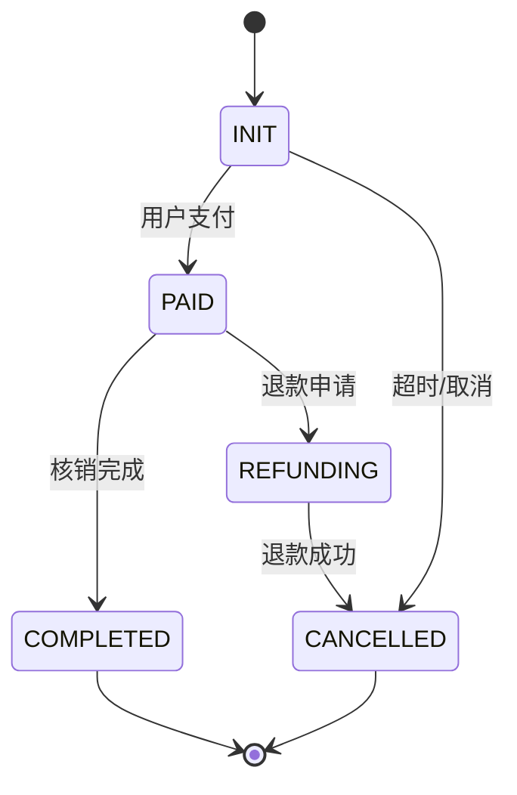

# 设计建议：Detail 节点增加业务对象状态机章节

## 背景

当前 PRD 文档的 `2.4 业务对象` 章节仅列出业务对象及其属性，但未描述对象的状态机逻辑。对于具有复杂状态流转的业务对象（如：订单、活动、商品上下架等），需要额外的章节来清晰定义状态定义和状态流转规则。

---

## 设计建议

### 一、新章节位置

在 detail 节点输出模板的 `4. 页面列表整合` 之后、`5. 页面结构和事件定义` 之前，新增 `X. 业务对象状态机` 章节。

**理由**：
- 状态机属于业务核心逻辑，应在页面设计之前定义清楚
- 与 `2.4 业务对象` 形成呼应：`2.4` 定义属性，`X` 定义状态行为

---

### 二、触发条件（何时生成此章节）

**方案 A（已选用）**：自动检测
- 检测 PRD `2.4 业务对象` 章节中的属性
- 如果某业务对象包含"状态"相关字段（`状态`、`state`、`status`）
- 且该状态字段的可能值 ≥ 3 个
- 则自动生成该业务对象的状态机章节

**检测逻辑示例**：
```javascript
// 检测是否包含状态字段
var hasStateField = 属性列表.some(attr =>
  /状态|state|status/i.test(attr) &&
  // 检查是否有多个状态值（通过上下文判断或枚举标注）
  hasMultipleValues
);
```

**备选方案 B（手动标注）**：
- 在 PRD 文档的 `2.4 业务对象` 章节中，使用特定标记（如 `*状态机*`）标注需要详细描述的对象

---

### 三、检测规则细化

| 检测条件 | 说明 | 示例 |
|---------|------|------|
| 属性名匹配 | 属性名包含"状态"或英文 status/state | `订单状态`、`activity_status` |
| 多状态判断 | 通过分析属性描述或枚举值判断状态数量 ≥ 3 | `状态：待支付/已支付/已完成/已取消` |
| 流转存在 | 检查是否存在状态流转相关的用户故事 | S07: "管理活动状态，控制活动上线和下线" |

**优先级**：流转存在 > 多状态判断 > 属性名匹配

---

### 四、章节结构建议

```markdown
### X. 业务对象状态机

> 仅当业务对象具有复杂状态流转时生成此章节。

#### X.1 {业务对象名称} 状态机

**状态定义表**

| 状态码 | 状态名称 | 状态描述 | 初始状态 | 终态 |
|--------|----------|----------|----------|------|
| INIT | 初始化 | 订单创建，等待支付 | ✓ | ✗ |
| PAID | 已支付 | 用户完成支付 | ✗ | ✗ |
| COMPLETED | 已完成 | 订单履约完成 | ✗ | ✓ |
| CANCELLED | 已取消 | 订单被取消 | ✗ | ✓ |

**状态流转表**

| 当前状态 | 触发事件 | 目标状态 | 流转条件 | 异常处理 |
|----------|----------|----------|----------|----------|
| INIT | 用户支付 | PAID | 支付成功 | 支付超时→超时关闭 |
| PAID | 核销完成 | COMPLETED | 礼品发放成功 | 发放失败→退款 |
| INIT | 超时/用户取消 | CANCELLED | 超过30分钟未支付 | - |
| PAID | 退款申请 | REFUNDING | 用户发起退款 | - |

**状态流转图（Mermaid）**



**关键规则说明**
- 支付超时时间：30分钟
- 退款申请后自动审批（金额 ≤ 100）或人工审批（金额 > 100）
- 已完成的订单不允许取消

---

### 五、Penpot 绘制映射

| PRD 内容 | 绘制方式 | 所在栏 |
|---------|---------|--------|
| 状态定义表 | 模拟表格 | 新增栏或合并到业务对象栏 |
| 状态流转表 | 模拟表格 | 新增栏或合并到业务对象栏 |
| 状态流转图 | 矩形+箭头流程图（横向） | 新增栏 |

**绘制方式**：
- 使用矩形表示状态节点
- 使用箭头表示流转方向
- 箭头旁边标注触发事件

---

### 六、关键设计原则

1. **仅复杂状态机才生成**：避免过度设计，简单的状态（如下架/上架）不需要详细描述
2. **状态必须闭环**：终态必须有明确的出口或标记为不可继续流转
3. **异常路径必须覆盖**：每个状态流转都需要考虑异常情况
4. **与事件定义联动**：状态流转的触发事件应与 `5.1.2 事件列表` 中的事件定义保持一致

---

### 七、具体修改位置

修改文件：`product_manager/nodes/06-detail.md`

**修改点 1**：在 `步骤5 技能操作步骤` 中增加条件判断逻辑
```markdown
# 步骤5 技能操作步骤
...
5. 逐页面定义页面结构和交互事件
5.1 检测是否存在复杂状态机的业务对象（如 2.4 章节中标记 *状态机* 的对象）
5.2 如存在，生成业务对象状态机章节（X）
6. 细化埋点方案和异常处理逻辑
```

**修改点 2**：在 `步骤6 输出模板结构` 中增加状态机章节模板
```markdown
### X. 业务对象状态机
（见上述章节结构）
```

**修改点 3**：在 `步骤8.6 内容映射规则` 中增加状态机栏的映射

**修改点 4**：在 `步骤8.3 整体布局策略` 中增加状态机栏（可选）

---

## 总结

| 项目 | 建议 |
|------|------|
| 章节位置 | `4. 页面列表整合` 之后，`5. 页面结构和事件定义` 之前 |
| 触发条件 | **自动检测**：属性包含"状态"关键词 + 状态值 ≥ 3 个 |
| 核心内容 | 状态定义表 + 状态流转表 + Mermaid 状态图 |
| Penpot 绘制 | 新增栏或并入业务对象栏，使用矩形+箭头绘制 |
| 设计原则 | 仅复杂状态机、状态闭环、异常覆盖、与事件联动 |
