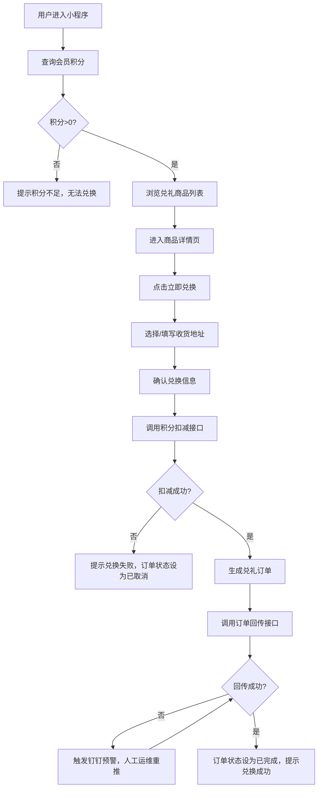

# 需求分析报告：天猫会员兑礼小程序
## 一、项目基本信息
| 项 | 说明 |
|-----|-----|
| 项目名称 | 天猫会员兑礼小程序 |
| 项目版本 | V1.0 |
| 项目类型 | 从0-1搭建的天猫小程序端积分兑礼应用 |
| 面向端口 | C端用户小程序、B端管理后台 |
| 核心能力 | 会员纯积分兑换礼品、B端活动与数据管理 |
## 二、需求背景与目标
### 2.1 需求背景
天猫商家目前缺少独立的小程序端会员积分兑礼入口，导致会员积分消耗渠道有限，用户缺乏积分价值感知；线下兑礼流程繁琐，用户体验不佳；同时运营侧缺少统一的兑礼活动管理平台，活动配置效率低，无法支撑多店铺多渠道的兑礼运营需求。
### 2.2 业务目标
| 目标类型 | 描述 | 衡量指标 | 目标值 |
|---------|------|---------|-------|
| 用户价值目标 | 提升会员积分价值感知，提供便捷的线上兑礼渠道 | 会员兑礼参与率 | ≥30% |
| 用户价值目标 | 简化兑礼流程，提升用户体验 | 兑礼流程完成率 | ≥85% |
| 业务效率目标 | 实现兑礼流程线上化自动化，降低人工成本 | 人工处理兑礼订单占比 | ≤5% |
| 业务效率目标 | 提供统一的活动管理后台，提升运营效率 | 单活动配置时间 | ≤30分钟 |
| 数据运营目标 | 完善兑礼行为数据采集，支撑运营决策 | 核心行为埋点覆盖率 | 100% |
## 三、用户类型和端口
### 3.1 用户角色与端口划分
| 用户角色 | 使用端口 | 核心诉求 |
|---------|---------|---------|
| 普通会员 | C端天猫小程序 | 便捷查询积分、浏览兑礼商品、完成积分兑换、查询订单 |
| 运营人员 | B端管理后台 | 配置兑礼活动、管理兑礼商品、查看兑礼数据报表 |
| 运维人员 | B端管理后台 | 处理异常订单、查看系统运行状态 |
### 3.2 核心业务流程
#### C端用户核心流程：
用户进入小程序 → 查询积分余额 → 浏览兑礼商品列表 → 进入商品详情 → 点击立即兑换 → 选择收货地址 → 确认兑换 → 积分扣减 → 生成兑礼订单 → 查看订单详情
#### B端运营核心流程：
运营登录管理后台 → 创建兑礼活动 → 配置活动商品信息 → 上架活动 → 查看活动数据报表 → 活动下线
## 四、业务对象
| 业务对象 | 对象属性 |
|---------|---------|
| 用户 | 用户ID、openId、会员等级、积分余额、绑定手机号、默认收货地址、历史兑礼记录 |
| 兑礼商品 | 商品ID、商品名称、商品描述、商品图片、兑换所需积分、库存数量、上架状态、所属活动ID |
| 兑礼活动 | 活动ID、活动名称、活动开始时间、活动结束时间、活动状态、关联商品列表、适用店铺范围 |
| 兑礼订单 | 订单ID、用户ID、商品ID、兑换积分数量、收货地址、订单状态、下单时间、积分扣减时间、订单回传状态 |
| 收货地址 | 地址ID、用户ID、收货人姓名、联系电话、省市区、详细地址、是否默认 |
## 五、业务流程图

## 六、页面流程和页面列表
### 6.1 C端页面流程
活动首页 → 商品列表页 → 商品详情页 → 地址选择页 → 订单确认页 → 兑换结果页 → 订单列表页 → 订单详情页
### 6.2 B端页面流程
登录页 → 首页看板 → 活动列表页 → 活动创建/编辑页 → 商品管理页 → 数据报表页 → 订单管理页
### 6.3 C端页面列表
| 页面名称 | 核心功能 | 用户操作 |
|---------|---------|---------|
| 活动首页 | 展示活动banner、用户积分信息、热门兑礼商品 | 查看积分、浏览热门商品、进入商品列表 |
| 商品列表页 | 展示所有可兑礼商品，支持筛选 | 浏览商品、搜索商品、进入商品详情 |
| 商品详情页 | 展示商品详情、所需积分、库存信息 | 查看商品信息、点击立即兑换 |
| 地址选择页 | 展示用户淘宝地址列表 | 选择收货地址、添加新地址 |
| 订单确认页 | 展示兑换商品信息、地址信息、消耗积分 | 确认兑换信息、提交兑换申请 |
| 兑换结果页 | 展示兑换成功/失败结果 | 查看兑换结果、进入订单列表、返回首页 |
| 订单列表页 | 展示用户历史兑礼订单 | 查看订单列表、进入订单详情 |
| 订单详情页 | 展示订单详细信息 | 查看订单状态、商品信息、收货地址 |
### 6.4 B端页面列表
| 页面名称 | 核心功能 | 用户操作 |
|---------|---------|---------|
| 登录页 | 管理后台登录 | 输入账号密码登录 |
| 首页看板 | 展示兑礼核心数据概览 | 查看活动数据、订单数据、用户参与数据 |
| 活动列表页 | 展示所有兑礼活动 | 查看活动列表、创建活动、编辑活动、上下架活动 |
| 活动编辑页 | 活动信息配置 | 填写活动基础信息、配置关联商品、设置活动规则 |
| 商品管理页 | 兑礼商品信息管理 | 新增商品、编辑商品信息、设置库存、上下架商品 |
| 数据报表页 | 多维度兑礼数据统计 | 查看活动效果报表、用户行为报表、兑换转化报表 |
| 订单管理页 | 兑礼订单查询与管理 | 查看订单列表、筛选订单、处理异常订单 |
## 七、埋点方案
| 埋点类型 | 埋点名称 | 触发时机 | 采集字段 |
|---------|---------|---------|---------|
| 曝光埋点 | 活动页曝光 | 用户进入活动首页 | 用户ID、活动ID、访问时间、渠道来源 |
| 曝光埋点 | 商品列表曝光 | 商品列表加载完成 | 用户ID、活动ID、商品列表总数、访问时间 |
| 曝光埋点 | 商品详情页曝光 | 用户进入商品详情页 | 用户ID、商品ID、活动ID、访问时间 |
| 曝光埋点 | 订单列表曝光 | 用户进入订单列表页 | 用户ID、订单总数、访问时间 |
| 点击埋点 | 商品卡片点击 | 用户点击商品卡片 | 用户ID、商品ID、活动ID、点击位置、点击时间 |
| 点击埋点 | 立即兑换点击 | 用户点击立即兑换按钮 | 用户ID、商品ID、活动ID、点击时间 |
| 点击埋点 | 地址选择点击 | 用户选择收货地址 | 用户ID、地址ID、点击时间 |
| 点击埋点 | 确认兑换点击 | 用户提交兑换申请 | 用户ID、商品ID、活动ID、消耗积分、点击时间 |
| 行为埋点 | 兑礼成功 | 用户兑换成功 | 用户ID、商品ID、活动ID、订单ID、消耗积分、完成时间 |
| 行为埋点 | 兑礼失败 | 用户兑换失败 | 用户ID、商品ID、活动ID、失败原因、时间 |
| 异常埋点 | 积分扣减失败 | 积分扣减接口调用失败 | 用户ID、商品ID、活动ID、错误码、错误信息、时间 |
| 异常埋点 | 订单回传失败 | 订单回传接口调用失败 | 用户ID、订单ID、错误码、错误信息、时间 |
## 八、异常场景处理
| 异常场景 | 异常描述 | 前端处理 | 后端处理 |
|---------|---------|---------|---------|
| 积分查询接口异常 | 调用会员中台查询积分接口失败 | 页面显示"当前积分查询失败，请稍后重试"，提供重试按钮 | 记录异常日志，重试机制 |
| 积分扣减接口异常 | 调用积分扣减接口超时或失败 | 页面显示"兑换失败，积分扣减失败"，订单状态标记为已取消 | 事务回滚，记录异常日志，触发告警 |
| 商品信息查询异常 | 调用兑礼中台查询商品接口失败 | 商品列表显示"当前商品加载失败，请稍后重试"，提供重试按钮 | 记录异常日志，重试机制 |
| 订单回传接口异常 | 调用中台订单回传接口失败 | 前端无感知，不影响用户兑换结果 | 记录异常日志，触发钉钉告警，自动重试3次，失败后人工处理 |
| 库存不足异常 | 兑换时商品库存不足 | 页面显示"当前商品库存不足，请选择其他商品" | 锁定库存机制，避免超卖 |
| 网络异常 | 用户端网络断开 | 显示网络异常提示，提供重试按钮 | 接口幂等设计，避免重复提交 |
## 九、待补充模块
> 以下模块待原型确认后补充：
> 1. 各页面详细交互说明
> 2. 全局交互规则说明
> 3. 完整的接口需求清单
> 4. 详细的权限管理方案
---
这是产品的详细第一版架构和业务逻辑，您看方向和基础逻辑准确吗？如果没问题，我们将先进行原型设计，通过具体的画面来进一步理清交互细节和可能遗漏的功能。
