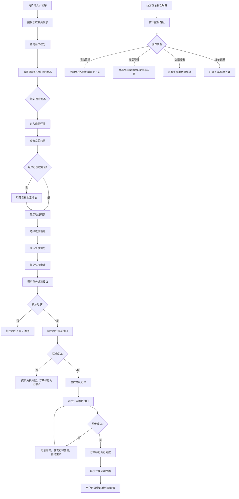

# 详细设计文档：天猫会员兑礼小程序 V1.0
## 一、业务背景和需求概述
本项目为从0-1搭建的天猫小程序端会员积分兑礼应用，核心目标是为会员提供便捷的纯积分兑礼渠道，提升积分价值感知，同时为运营提供统一的活动管理后台，提升兑礼运营效率。
核心能力包括：
- C端：积分查询、商品浏览、积分兑换、订单管理
- B端：活动管理、商品管理、订单管理、数据报表
## 二、用户故事拆分
### 2.1 Epic级需求梳理
| Epic ID | Epic名称 | 业务域 | 描述 |
|---------|---------|--------|------|
| EPIC-001 | C端会员兑礼核心流程 | C端用户域 | 覆盖用户从进入小程序到完成兑礼的全流程 |
| EPIC-002 | C端订单管理 | C端用户域 | 用户查看历史兑礼订单和订单详情 |
| EPIC-003 | B端活动管理 | B端运营域 | 运营人员创建、编辑、上下架兑礼活动 |
| EPIC-004 | B端商品管理 | B端运营域 | 运营人员管理兑礼商品信息和库存 |
| EPIC-005 | B端数据运营 | B端运营域 | 运营人员查看兑礼数据报表和统计分析 |
| EPIC-006 | B端订单管理 | B端运维域 | 运维人员处理异常订单和订单查询 |
### 2.2 用户故事拆分
| 故事ID | 用户角色 | 用户故事描述 | 验收标准 | 优先级 |
|--------|----------|--------------|----------|--------|
| US-001 | 普通会员 | 作为会员，我想要进入小程序后查看我的积分余额，以便了解我可以兑换的商品 | 1. 进入小程序后首页顶部展示当前积分余额 2. 积分数据实时同步会员中台 | Must have |
| US-002 | 普通会员 | 作为会员，我想要浏览可兑换的商品列表，以便选择我想要兑换的礼品 | 1. 首页展示热门兑礼商品 2. 商品列表页展示所有可兑换商品 3. 商品卡片展示商品图片、名称、所需积分 | Must have |
| US-003 | 普通会员 | 作为会员，我想要查看商品详情，以便了解商品的详细信息和兑换规则 | 1. 点击商品卡片进入商品详情页 2. 详情页展示商品图片、描述、所需积分、库存状态 | Must have |
| US-004 | 普通会员 | 作为会员，我想要选择收货地址，以便兑换的礼品可以准确送达 | 1. 兑换时自动同步淘宝地址列表 2. 支持选择默认地址或添加新地址 | Must have |
| US-005 | 普通会员 | 作为会员，我想要确认兑换信息并提交兑换申请，以便完成积分兑礼 | 1. 确认页展示商品信息、收货地址、消耗积分 2. 点击确认后提交兑换申请 | Must have |
| US-006 | 普通会员 | 作为会员，我想要查看兑换结果，以便了解是否兑换成功 | 1. 兑换成功展示成功页面，提示预计发货时间 2. 兑换失败展示失败原因，引导重新兑换 | Must have |
| US-007 | 普通会员 | 作为会员，我想要查看我的历史兑礼订单，以便了解兑换记录 | 1. 个人中心有订单入口 2. 订单列表展示所有历史订单，按时间倒序排列 | Must have |
| US-008 | 普通会员 | 作为会员，我想要查看订单详情，以便了解订单的详细状态 | 1. 点击订单卡片进入订单详情页 2. 详情页展示商品信息、兑换积分、收货地址、订单状态 | Must have |
| US-009 | 运营人员 | 作为运营，我想要创建兑礼活动，以便开展不同的兑礼营销活动 | 1. 支持配置活动名称、时间范围、适用店铺 2. 支持关联多个兑礼商品 | Must have |
| US-010 | 运营人员 | 作为运营，我想要管理兑礼商品，以便维护商品信息和库存 | 1. 支持新增、编辑、删除商品 2. 支持设置商品兑换积分、库存数量、上下架状态 | Must have |
| US-011 | 运营人员 | 作为运营，我想要查看兑礼数据报表，以便了解活动效果和用户参与情况 | 1. 展示核心数据概览：参与人数、兑换人次、积分消耗总量 2. 支持按活动维度查看详细数据 | Should have |
| US-012 | 运维人员 | 作为运维，我想要查询和管理兑礼订单，以便处理异常订单 | 1. 支持按订单状态、用户、时间筛选订单 2. 支持手动重推同步失败的订单 | Could have |
## 三、业务流程图和页面流程图
### 3.1 完整业务流程图

### 3.2 页面流程图
#### C端页面流程：
```
小程序启动页 → 授权登录页 → 活动首页 → 商品列表页 → 商品详情页 → 地址选择页 → 订单确认页 → 兑换结果页 → 订单列表页 → 订单详情页
```
#### B端页面流程：
```
登录页 → 首页看板 → 活动列表页 → 活动编辑页 → 商品管理页 → 数据报表页 → 订单管理页
```
## 四、页面列表整合
### 4.1 C端页面列表
| 页面ID | 页面名称 | 所属模块 | 功能描述 | 关联用户故事 |
|--------|----------|----------|----------|--------------|
| PAGE-C-001 | 启动授权页 | 基础模块 | 引导用户授权登录，获取会员信息 | US-001 |
| PAGE-C-002 | 活动首页 | 基础模块 | 展示用户积分、活动banner、热门兑礼商品 | US-001, US-002 |
| PAGE-C-003 | 商品列表页 | 商品模块 | 展示所有可兑礼商品，支持搜索筛选 | US-002 |
| PAGE-C-004 | 商品详情页 | 商品模块 | 展示商品详细信息、兑换按钮 | US-003 |
| PAGE-C-005 | 地址选择页 | 订单模块 | 展示用户淘宝地址列表，支持选择地址 | US-004 |
| PAGE-C-006 | 订单确认页 | 订单模块 | 展示兑换信息，提交兑换申请 | US-005 |
| PAGE-C-007 | 兑换结果页 | 订单模块 | 展示兑换成功/失败结果 | US-006 |
| PAGE-C-008 | 订单列表页 | 订单模块 | 展示用户历史兑礼订单 | US-007 |
| PAGE-C-009 | 订单详情页 | 订单模块 | 展示订单详细信息和状态 | US-008 |
### 4.2 B端页面列表
| 页面ID | 页面名称 | 所属模块 | 功能描述 | 关联用户故事 |
|--------|----------|----------|----------|--------------|
| PAGE-B-001 | 登录页 | 基础模块 | 管理后台账号密码登录 | - |
| PAGE-B-002 | 首页看板 | 数据模块 | 展示兑礼核心数据概览 | US-011 |
| PAGE-B-003 | 活动列表页 | 活动模块 | 展示所有兑礼活动，支持上下架 | US-009 |
| PAGE-B-004 | 活动编辑页 | 活动模块 | 创建/编辑兑礼活动信息 | US-009 |
| PAGE-B-005 | 商品管理页 | 商品模块 | 管理兑礼商品信息和库存 | US-010 |
| PAGE-B-006 | 数据报表页 | 数据模块 | 多维度兑礼数据统计分析 | US-011 |
| PAGE-B-007 | 订单管理页 | 订单模块 | 订单查询和异常处理 | US-012 |
## 五、页面结构和事件定义
### 5.1 活动首页 (PAGE-C-002)
#### 5.1.1 页面结构定义
```
- 顶部导航栏：
  - 左侧：返回按钮（仅从二级页面返回时显示）
  - 中间：活动名称
  - 右侧：我的订单入口
- 内容区域：
  - 用户信息模块：头像、昵称、当前积分余额、等级标识
  - Banner轮播模块：活动宣传banner，支持点击跳转
  - 热门商品模块：横向滚动的热门兑礼商品卡片（图片、名称、所需积分）
  - 全部商品入口：点击进入商品列表页
- 底部导航栏：首页、我的订单、个人中心
```
#### 5.1.2 事件列表
| 事件编号 | 事件名称 | 绑定页面 | 触发节点 | 事件描述 | 关联用户故事 |
|---------|---------|---------|---------|---------|--------------|
| /home/feat-01 | 查询会员信息 | 首页 | 页面载入时 | 调用会员中台接口查询用户积分和等级信息 | US-001 |
| /home/feat-02 | 查询热门商品 | 首页 | 页面载入时 | 调用兑礼中台接口查询热门兑礼商品列表 | US-002 |
| /home/feat-03 | 点击商品卡片 | 首页 | 用户点击商品卡片 | 跳转到对应商品的详情页 | US-002, US-003 |
| /home/feat-04 | 点击全部商品入口 | 首页 | 用户点击全部商品按钮 | 跳转到商品列表页 | US-002 |
| /home/feat-05 | 点击我的订单入口 | 首页 | 用户点击右上角我的订单 | 跳转到订单列表页 | US-007 |
##### 5.1.3 事件逻辑：查询会员信息 (/home/feat-01)
**接口交互逻辑**：
- 触发时机：页面加载完成后
- 调用接口：`/api/interface/third/member/queryMemberPoints`
- 入参：`brand_code`, `program_code`, `queryType`, `value`(用户openId)
- 出参解析：提取`data.points`字段展示在页面上
**异常处理**：
| 异常场景 | 异常编号 | 判断方式 | 处理方案 |
|---------|---------|---------|---------|
| 接口调用失败 | /home/feat-01-err01 | HTTP状态码 != 200 | 显示"积分查询失败，请下拉刷新重试"提示 |
| 会员信息不存在 | /home/feat-01-err02 | 返回code != 0 | 提示"您还不是本品牌会员，请先注册" |
| 数据格式错误 | /home/feat-01-err03 | 积分字段为空或非数字 | 显示积分为0，提示"积分数据异常" |
### 5.2 商品详情页 (PAGE-C-004)
#### 5.2.1 页面结构定义
```
- 顶部导航栏：
  - 左侧：返回按钮
  - 中间：商品详情
  - 右侧：分享按钮
- 内容区域：
  - 商品图片轮播：多张商品展示图
  - 商品基础信息：商品名称、所需积分、库存状态
  - 商品描述：详细的商品介绍和兑换规则
  - 兑换须知：兑换说明、发货时间、注意事项
- 底部固定栏：
  - 左侧：展示所需积分和用户当前积分
  - 右侧：立即兑换按钮（库存不足时置灰不可点击）
```
#### 5.2.2 事件列表
| 事件编号 | 事件名称 | 绑定页面 | 触发节点 | 事件描述 | 关联用户故事 |
|---------|---------|---------|---------|---------|--------------|
| /goods-detail/feat-01 | 查询商品详情 | 商品详情页 | 页面载入时 | 根据商品ID调用兑礼中台接口查询商品详细信息 | US-003 |
| /goods-detail/feat-02 | 点击立即兑换 | 商品详情页 | 用户点击立即兑换按钮 | 校验用户积分和库存，跳转到地址选择页 | US-003, US-004 |
##### 5.2.3 事件逻辑：点击立即兑换 (/goods-detail/feat-02)
**业务流程**：
```mermaid
flowchart TD
    A[用户点击立即兑换] --> B{商品库存>0?}
    B -->|否| C[Toast提示"商品库存不足，请选择其他商品"]
    B -->|是| D[调用积分试算接口]
    D --> E{用户积分≥所需积分?}
    E -->|否| F[Toast提示"您的积分不足，无法兑换"]
    E -->|是| G[跳转到地址选择页]
```
**异常处理**：
| 异常场景 | 异常编号 | 判断方式 | 处理方案 |
|---------|---------|---------|---------|
| 商品已下架 | /goods-detail/feat-02-err01 | 商品状态为下架 | 提示"当前商品已下架"，返回商品列表 |
| 积分试算接口失败 | /goods-detail/feat-02-err02 | 接口调用失败 | 提示"兑换信息校验失败，请重试" |
## 六、埋点方案细化
| 埋点ID | 埋点名称 | 触发时机 | 采集字段 | 所属页面 |
|---------|---------|---------|---------|----------|
| TRACK-001 | 页面曝光-首页 | 用户进入首页 | 用户ID、活动ID、访问时间、渠道来源 | PAGE-C-002 |
| TRACK-002 | 页面曝光-商品列表 | 用户进入商品列表页 | 用户ID、活动ID、访问时间 | PAGE-C-003 |
| TRACK-003 | 页面曝光-商品详情 | 用户进入商品详情页 | 用户ID、商品ID、活动ID、访问时间 | PAGE-C-004 |
| TRACK-004 | 行为-商品点击 | 用户点击商品卡片 | 用户ID、商品ID、活动ID、点击位置、点击时间 | PAGE-C-002, PAGE-C-003 |
| TRACK-005 | 行为-立即兑换点击 | 用户点击立即兑换按钮 | 用户ID、商品ID、活动ID、点击时间 | PAGE-C-004 |
| TRACK-006 | 行为-兑换提交 | 用户提交兑换申请 | 用户ID、商品ID、活动ID、消耗积分、提交时间 | PAGE-C-006 |
| TRACK-007 | 转化-兑换成功 | 兑换成功 | 用户ID、商品ID、活动ID、订单ID、消耗积分、完成时间 | PAGE-C-007 |
| TRACK-008 | 转化-兑换失败 | 兑换失败 | 用户ID、商品ID、活动ID、失败原因、时间 | PAGE-C-007 |
---
这是详细设计的完整内容，包含了用户故事拆分、完整业务流程、页面结构定义和交互事件说明。您看内容是否符合预期？确认后我们将进入原型设计阶段。
