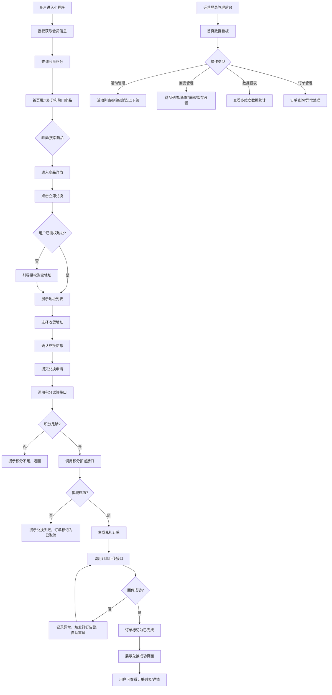

# 详细设计文档：天猫会员兑礼小程序 V1.0（新模板验证）

## 一、业务背景和需求概述
本项目为从0-1搭建的天猫小程序端会员积分兑礼应用，核心目标是为会员提供便捷的纯积分兑礼渠道，提升积分价值感知，同时为运营提供统一的活动管理后台，提升兑礼运营效率。
核心能力包括：
- C端：积分查询、商品浏览、积分兑换、订单管理
- B端：活动管理、商品管理、订单管理、数据报表

## 二、用户故事拆分
### 2.1 Epic级需求梳理
| Epic ID | Epic名称 | 业务域 | 描述 |
|---------|---------|--------|------|
| EPIC-001 | C端会员兑礼核心流程 | C端用户域 | 覆盖用户从进入小程序到完成兑礼的全流程 |
| EPIC-002 | C端订单管理 | C端用户域 | 用户查看历史兑礼订单和订单详情 |
| EPIC-003 | B端活动管理 | B端运营域 | 运营人员创建、编辑、上下架兑礼活动 |
| EPIC-004 | B端商品管理 | B端运营域 | 运营人员管理兑礼商品信息和库存 |
| EPIC-005 | B端数据运营 | B端运营域 | 运营人员查看兑礼数据报表和统计分析 |
| EPIC-006 | B端订单管理 | B端运维域 | 运维人员处理异常订单和订单查询 |

### 2.2 用户故事拆分
| 故事ID | 用户角色 | 用户故事描述 | 验收标准 | 优先级 |
|--------|----------|--------------|----------|--------|
| US-001 | 普通会员 | 作为会员，我想要进入小程序后查看我的积分余额，以便了解我可以兑换的商品 | 1. 进入小程序后首页顶部展示当前积分余额 2. 积分数据实时同步会员中台 | Must have |
| US-002 | 普通会员 | 作为会员，我想要浏览可兑换的商品列表，以便选择我想要兑换的礼品 | 1. 首页展示热门兑礼商品 2. 商品列表页展示所有可兑换商品 3. 商品卡片展示商品图片、名称、所需积分 | Must have |
| US-003 | 普通会员 | 作为会员，我想要查看商品详情，以便了解商品的详细信息和兑换规则 | 1. 点击商品卡片进入商品详情页 2. 详情页展示商品图片、描述、所需积分、库存状态 | Must have |
| US-004 | 普通会员 | 作为会员，我想要选择收货地址，以便兑换的礼品可以准确送达 | 1. 兑换时自动同步淘宝地址列表 2. 支持选择默认地址或添加新地址 | Must have |
| US-005 | 普通会员 | 作为会员，我想要确认兑换信息并提交兑换申请，以便完成积分兑礼 | 1. 确认页展示商品信息、收货地址、消耗积分 2. 点击确认后提交兑换申请 | Must have |
| US-006 | 普通会员 | 作为会员，我想要查看兑换结果，以便了解是否兑换成功 | 1. 兑换成功展示成功页面，提示预计发货时间 2. 兑换失败展示失败原因，引导重新兑换 | Must have |
| US-007 | 普通会员 | 作为会员，我想要查看我的历史兑礼订单，以便了解兑换记录 | 1. 个人中心有订单入口 2. 订单列表展示所有历史订单，按时间倒序排列 | Must have |
| US-008 | 普通会员 | 作为会员，我想要查看订单详情，以便了解订单的详细状态 | 1. 点击订单卡片进入订单详情页 2. 详情页展示商品信息、兑换积分、收货地址、订单状态 | Must have |
| US-009 | 运营人员 | 作为运营，我想要创建兑礼活动，以便开展不同的兑礼营销活动 | 1. 支持配置活动名称、时间范围、适用店铺 2. 支持关联多个兑礼商品 | Must have |
| US-010 | 运营人员 | 作为运营，我想要管理兑礼商品，以便维护商品信息和库存 | 1. 支持新增、编辑、删除商品 2. 支持设置商品兑换积分、库存数量、上下架状态 | Must have |
| US-011 | 运营人员 | 作为运营，我想要查看兑礼数据报表，以便了解活动效果和用户参与情况 | 1. 展示核心数据概览：参与人数、兑换人次、积分消耗总量 2. 支持按活动维度查看详细数据 | Should have |
| US-012 | 运维人员 | 作为运维，我想要查询和管理兑礼订单，以便处理异常订单 | 1. 支持按订单状态、用户、时间筛选订单 2. 支持手动重推同步失败的订单 | Could have |

## 三、业务流程图和页面流程图
### 3.1 完整业务流程图


### 3.2 页面流程图
#### C端页面流程：
```
小程序启动页 → 授权登录页 → 活动首页 → 商品列表页 → 商品详情页 → 地址选择页 → 订单确认页 → 兑换结果页 → 订单列表页 → 订单详情页
```
#### B端页面流程：
```
登录页 → 首页看板 → 活动列表页 → 活动编辑页 → 商品管理页 → 数据报表页 → 订单管理页
```

## 四、页面列表整合
### 4.1 C端页面列表
| 页面ID | 页面名称 | 所属模块 | 功能描述 | 关联用户故事 |
|--------|----------|----------|----------|--------------|
| PAGE-C-001 | 启动授权页 | 基础模块 | 引导用户授权登录，获取会员信息 | US-001 |
| PAGE-C-002 | 活动首页 | 基础模块 | 展示用户积分、活动banner、热门兑礼商品 | US-001, US-002 |
| PAGE-C-003 | 商品列表页 | 商品模块 | 展示所有可兑礼商品，支持搜索筛选 | US-002 |
| PAGE-C-004 | 商品详情页 | 商品模块 | 展示商品详细信息、兑换按钮 | US-003 |
| PAGE-C-005 | 地址选择页 | 订单模块 | 展示用户淘宝地址列表，支持选择地址 | US-004 |
| PAGE-C-006 | 订单确认页 | 订单模块 | 展示兑换信息，提交兑换申请 | US-005 |
| PAGE-C-007 | 兑换结果页 | 订单模块 | 展示兑换成功/失败结果 | US-006 |
| PAGE-C-008 | 订单列表页 | 订单模块 | 展示用户历史兑礼订单 | US-007 |
| PAGE-C-009 | 订单详情页 | 订单模块 | 展示订单详细信息和状态 | US-008 |

### 4.2 B端页面列表
| 页面ID | 页面名称 | 所属模块 | 功能描述 | 关联用户故事 |
|--------|----------|----------|----------|--------------|
| PAGE-B-001 | 登录页 | 基础模块 | 管理后台账号密码登录 | - |
| PAGE-B-002 | 首页看板 | 数据模块 | 展示兑礼核心数据概览 | US-011 |
| PAGE-B-003 | 活动列表页 | 活动模块 | 展示所有兑礼活动，支持上下架 | US-009 |
| PAGE-B-004 | 活动编辑页 | 活动模块 | 创建/编辑兑礼活动信息 | US-009 |
| PAGE-B-005 | 商品管理页 | 商品模块 | 管理兑礼商品信息和库存 | US-010 |
| PAGE-B-006 | 数据报表页 | 数据模块 | 多维度兑礼数据统计分析 | US-011 |
| PAGE-B-007 | 订单管理页 | 订单模块 | 订单查询和异常处理 | US-012 |

## 五、页面结构和事件定义（新模板）

### 5.1 活动首页 (PAGE-C-002)

#### 5.1.1 页面结构定义
```
- 顶部导航栏：
  - 左侧：返回按钮（仅从二级页面返回时显示）
  - 中间：活动名称
  - 右侧：我的订单入口
- 内容区域：
  - 用户信息模块：头像、昵称、当前积分余额、等级标识
  - Banner轮播模块：活动宣传banner，支持点击跳转
  - 热门商品模块：横向滚动的热门兑礼商品卡片（图片、名称、所需积分）
  - 全部商品入口：点击进入商品列表页
- 底部导航栏：首页、我的订单、个人中心
```

#### 5.1.2 事件列表
**事件编号规范：`/{pageNameInEN}/feat-{序号}`**

| 事件编号 | 事件名称 | 事件类型 | 绑定页面 | 触发条件 | 前端职责 | 后端职责 | 关联埋点 | 关联用户故事 |
|---------|---------|---------|---------|---------|---------|---------|---------|--------------|
| /home/feat-01 | 查询会员信息 | 页面加载 | 首页 | 页面 `onLoad` 生命周期触发，且用户已登录（token 有效） | 1. 调用会员信息查询接口 2. 渲染积分和等级信息 3. 异常时展示兜底 UI | 提供会员信息查询接口，返回积分、等级、有效期 | TRACK-001 | US-001 |
| /home/feat-02 | 查询热门商品 | 页面加载 | 首页 | 页面 `onLoad` 生命周期触发，且会员信息加载完成 | 1. 调用热门商品查询接口 2. 渲染热门商品列表 3. 支持横向滚动 | 提供热门商品查询接口，返回商品列表 | TRACK-001 | US-002 |
| /home/feat-03 | 点击商品卡片 | 用户点击 | 首页 | 用户点击热门商品卡片 | 1. 跳转至商品详情页 2. 传递商品ID | 无 | TRACK-004 | US-002, US-003 |
| /home/feat-04 | 点击全部商品入口 | 用户点击 | 首页 | 用户点击"全部商品"按钮 | 1. 跳转至商品列表页 2. 无参数传递 | 无 | TRACK-004 | US-002 |
| /home/feat-05 | 点击我的订单入口 | 用户点击 | 首页 | 用户点击右上角"我的订单" | 1. 跳转至订单列表页 | 无 | - | US-007 |

#### 5.1.3 事件数据流

##### /home/feat-01 数据流（查询会员信息）

**数据来源**：
- 来源1：会员中台 —— 获取用户积分余额、会员等级、积分过期时间
- 来源2：本地缓存 —— 获取用户登录态（token）

**数据处理**：
1. 登录态校验：判断 token 是否有效，无效则引导重新授权
2. 数据渲染：将积分和等级信息渲染到用户信息模块
3. 过期提醒：判断积分是否即将过期，展示过期提示

**数据去向**：
- **去向1-展示**：积分余额渲染到首页顶部用户信息区域，等级标识渲染到头像旁
- **去向2-下游**：积分余额作为后续兑换流程的校验依据，传递给商品详情页和订单确认页
- **去向3-埋点**：上报 TRACK-001（页面曝光-首页），携带用户身份信息

##### /home/feat-02 数据流（查询热门商品）

**数据来源**：
- 来源1：兑礼中台 —— 获取热门兑礼商品列表
- 来源2：活动配置 —— 获取当前生效的活动ID

**数据处理**：
1. 活动校验：判断当前是否有生效的兑礼活动
2. 商品筛选：按热度排序，取前N条商品
3. 状态标记：标记每个商品的库存状态（充足/紧张/售罄）

**数据去向**：
- **去向1-展示**：商品列表渲染到首页热门商品模块，支持横向滚动
- **去向2-埋点**：上报 TRACK-001（页面曝光-首页），携带活动ID

#### 5.1.4 事件状态流转（可选）

本页面事件均为简单查询/跳转事件，无需状态机。

#### 5.1.5 异常处理

**异常编号规范：`/{pageNameInEN}/feat-{序号}/err-{序号}`**

| 异常场景 | 异常编号 | 异常分类 | 判断方式 | 前端处理方案 | 数据流影响 |
|---------|---------|---------|---------|-------------|-----------|
| 接口调用失败 | /home/feat-01/err-01 | 网络异常 | HTTP 状态码 != 200 或请求超时 | 展示"网络异常，请检查网络后重试"，提供重试按钮 | 数据未到达服务端，前端保留上次缓存数据，用户可重试 |
| 会员信息不存在 | /home/feat-01/err-02 | 业务异常 | 返回 code = "MEMBER_NOT_FOUND" | 提示"您还不是本品牌会员"，引导跳转注册页 | 数据在会员中台不存在，前端引导用户走注册流程，注册成功后重新触发事件 |
| 数据格式错误 | /home/feat-01/err-03 | 前端异常 | 积分字段为空或非数字 | 展示积分为 0，上报监控，提示"数据加载异常" | 数据解析失败，前端使用兜底默认值，不影响其他数据流 |
| 热门商品接口失败 | /home/feat-02/err-01 | 网络异常 | HTTP 状态码 != 200 | 展示"商品加载失败"，提供重试按钮 | 商品数据未加载，热门商品模块展示为空状态 |

#### 5.1.6 埋点数据流

| 埋点编号 | 埋点名称 | 数据来源 | 触发时机 | 数据去向 |
|---------|---------|---------|---------|---------|
| TRACK-001 | 页面曝光-首页 | 页面路由信息、用户身份信息、活动信息 | 页面 onLoad 且数据加载完成 | 上报至数据分析平台，用于 PV/UV 统计 |
| TRACK-004 | 行为-商品点击 | 商品信息、用户身份信息、点击位置 | 用户点击商品卡片 | 上报至数据分析平台，用于点击转化漏斗分析 |

#### 5.1.7 前端状态管理建议（可选）

| 状态域 | 状态说明 | 数据来源 | 初始值 | 更新时机 | 数据去向 |
|--------|---------|---------|--------|---------|---------|
| userInfo | 用户信息（积分、等级） | 会员中台接口 | null | 页面加载完成后 | 渲染到首页用户信息模块 |
| hotProducts | 热门商品列表 | 兑礼中台接口 | [] | 接口返回后 | 渲染到热门商品模块 |
| loadingStatus | 加载状态 | 前端内部状态 | "idle" | 请求发起/返回/异常时 | 控制 Loading 组件展示/隐藏 |
| errorInfo | 错误信息 | 接口返回/前端捕获 | null | 异常发生时 | 渲染到 Toast/弹窗/错误占位图 |

---

### 5.2 商品详情页 (PAGE-C-004)

#### 5.2.1 页面结构定义
```
- 顶部导航栏：
  - 左侧：返回按钮
  - 中间：商品详情
  - 右侧：分享按钮
- 内容区域：
  - 商品图片轮播：多张商品展示图
