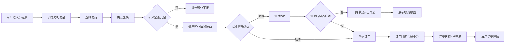

# PRD文档 - V1.0

## 1. 项目概述

### 1.1 需求背景与目标

**背景**：
当前会员体系中，会员积分作为核心权益之一，存在权益感知弱、利用率低的问题。具体表现为：
- 会员不清楚自己有多少积分、积分能做什么
- 缺乏直观、便捷的积分消耗渠道
- 积分长期处于沉睡状态，未能有效驱动会员活跃

**业务目标**：

| 目标类型 | 描述 | 衡量指标 | 目标值 |
|---------|------|---------|--------|
| 用户价值 | 让会员清晰感知积分价值，提供便捷的积分兑换入口 | 小程序访问量 | 提升50% |
| 业务价值 | 提升积分使用率，通过积分兑礼活动激活沉默会员 | 积分使用率 | 提升30% |
| 运营价值 | 支持会员节等营销活动，打造积分消耗场景 | 兑礼订单量 | 月均1000+ |

### 1.2 用户角色

| 用户角色 | 端口 | 描述 |
|---------|------|------|
| 会员用户 | 小程序端 | 使用积分兑换礼品的C端用户 |
| 运营人员 | 管理端 | 配置活动、管理商品、查看数据的B端用户 |
| 系统管理员 | 管理端 | 管理用户权限、渠道店铺配置的管理员 |

## 2. 需求分析

### 2.1 业务流程图

**C端核心流程**：用户进入小程序 -> 浏览兑礼商品 -> 选择商品 -> 确认兑换 -> 积分扣减 -> 订单记录 -> 订单回传 -> 订单状态=已完成

**逆向流程**：用户进入小程序 -> 浏览兑礼商品 -> 选择商品 -> 确认兑换 -> 积分扣减 -> 扣减失败 -> 订单状态=已取消

### 2.2 页面列表

#### C端页面（小程序端）

| 页面编号 | 页面名称 | 页面功能 | 用户操作 |
|---------|---------|---------|---------|
| /home | 首页 | 展示活动信息、会员积分、兑礼商品入口 | 浏览、点击进入商品列表 |
| /productList | 商品列表 | 展示所有可兑换商品 | 浏览、筛选、点击进入详情 |
| /productDetail | 商品详情 | 展示商品详细信息、积分价格 | 查看、点击兑换 |
| /confirmExchange | 确认兑换 | 选择收货地址、确认订单信息 | 选择地址、确认兑换 |
| /exchangeResult | 兑换结果 | 展示兑换成功/失败结果 | 查看结果、返回首页/订单 |
| /orderList | 我的订单 | 展示所有兑礼订单列表 | 查看列表、点击进入详情 |
| /orderDetail | 订单详情 | 展示订单详细信息、物流信息 | 查看详情 |

#### B端页面（管理端）

| 页面编号 | 页面名称 | 页面功能 | 用户操作 |
|---------|---------|---------|---------|
| /activityList | 活动列表 | 展示所有兑礼活动 | 查看、搜索、新建、编辑、启用/禁用 |
| /activityEdit | 活动创建/编辑 | 配置活动基础信息、活动规则、装修 | 填写表单、上传素材、保存 |
| /productManage | 商品管理 | 展示从兑礼中台同步的商品 | 查看、同步、上下架配置 |
| /dashboard | 数据看板 | 展示活动曝光、订单报表 | 查看数据、筛选时间范围 |
| /orderManage | 订单管理 | 展示所有兑礼订单 | 查看、搜索、处理异常 |
| /permission | 权限管理 | 管理用户渠道店铺授权 | 查看、授权、取消授权 |

### 2.3 功能列表

#### C端功能

| 功能模块 | 功能点 | 优先级 |
|---------|--------|--------|
| 会员中心 | 积分余额展示 | P0 |
| 会员中心 | 会员等级展示 | P0 |
| 兑礼商城 | 商品列表展示 | P0 |
| 兑礼商城 | 商品详情展示 | P0 |
| 兑礼流程 | 收货地址选择 | P0 |
| 兑礼流程 | 积分扣减 | P0 |
| 订单管理 | 订单列表展示 | P0 |
| 订单管理 | 订单详情展示 | P0 |
| 订单管理 | 物流信息展示 | P1 |

#### B端功能

| 功能模块 | 功能点 | 优先级 |
|---------|--------|--------|
| 活动管理 | 活动创建 | P0 |
| 活动管理 | 活动编辑 | P0 |
| 活动管理 | 活动启用/禁用 | P0 |
| 活动管理 | 多渠道多店铺配置 | P0 |
| 商品管理 | 商品同步 | P0 |
| 商品管理 | 商品上下架 | P0 |
| 数据看板 | 活动曝光数据 | P1 |
| 数据看板 | 兑礼订单报表 | P1 |
| 系统配置 | 渠道店铺权限管理 | P0 |

### 2.4 业务对象

| 业务对象 | 对象属性 |
|---------|---------|
| 用户 | 用户ID、openid、member_code、会员等级、积分余额、注册时间 |
| 活动 | 活动ID、活动名称、活动说明、开始时间、结束时间、渠道、店铺、状态、创建时间 |
| 商品 | 商品ID、商品名称、商品描述、商品图片、所需积分、库存数量、上架状态 |
| 订单 | 订单ID、用户ID、活动ID、商品ID、订单状态、所需积分、收货地址、物流单号、创建时间 |
| 地址 | 地址ID、用户ID、收货人姓名、手机号、省市区、详细地址 |

### 2.5 用户故事

| 故事编号 | 端口 | 用户故事 |
|---------|------|---------|
| S01 | 小程序端 | 作为一个会员，我需要查看我的积分余额和等级，以便了解我能兑换什么礼品 |
| S02 | 小程序端 | 作为一个会员，我需要浏览兑礼商品列表，以便找到感兴趣的礼品 |
| S03 | 小程序端 | 作为一个会员，我需要查看商品详情，以便了解商品信息和所需积分 |
| S04 | 小程序端 | 作为一个会员，我需要选择收货地址并确认兑换，以便完成积分兑礼 |
| S05 | 小程序端 | 作为一个会员，我需要查看我的兑礼订单，以便了解订单状态和物流信息 |
| S06 | 管理端 | 作为一个运营人员，我需要创建兑礼活动，以便在特定时间开展积分兑礼 |
| S07 | 管理端 | 作为一个运营人员，我需要管理活动状态，以便控制活动上线和下线 |
| S08 | 管理端 | 作为一个运营人员，我需要查看数据看板，以便了解活动效果和订单情况 |
| S09 | 管理端 | 作为一个管理员，我需要配置用户权限，以便控制数据访问范围 |

### 2.6 埋点方案

| 事件编号 | 事件名称 | 触发场景 | 埋点字段 |
|---------|---------|---------|---------|
| /home/feat-01 | 小程序曝光 | 用户进入小程序 | 活动ID、用户ID、member_code、曝光时间 |
| /productDetail/feat-01 | 商品浏览 | 用户查看商品详情 | 活动ID、用户ID、member_code、商品ID、浏览时间 |
| /confirmExchange/feat-01 | 兑换成功 | 用户成功完成积分兑换 | 活动ID、用户ID、member_code、商品ID、订单ID、兑换时间 |
| /confirmExchange/feat-02 | 兑换失败 | 用户积分兑换失败 | 活动ID、用户ID、member_code、商品ID、失败原因、失败时间 |
| /orderDetail/feat-01 | 订单查看 | 用户查看订单详情 | 活动ID、用户ID、member_code、订单ID、查看时间 |

### 2.7 异常场景

| 异常编号 | 异常场景 | 触发条件 | 处理方式 | 用户提示 |
|---------|---------|---------|---------|---------|
| /confirmExchange/feat-01/err-01 | 积分不足 | 用户积分小于商品所需积分 | 前端拦截，不创建订单 | 积分不足，无法兑换 |
| /confirmExchange/feat-01/err-02 | 积分扣减失败 | 3.2.9接口失败或3.2.16查询失败 | 重试2次，失败则订单取消 | 兑换失败，积分扣减失败 |
| /confirmExchange/feat-01/err-03 | 订单同步失败 | 订单回传会员中台失败 | 钉钉预警，人工运维重推 | 用户端无感知 |
| /productList/feat-01/err-01 | 商品同步失败 | 从兑礼中台获取商品信息失败 | 钉钉预警，人工介入处理 | 用户端无感知 |
| /confirmExchange/feat-01/err-04 | 地址获取失败 | 淘宝地址接口调用失败 | 提示用户手动输入地址 | 地址获取失败，请手动输入 |
