# PRD文档 - V1.0

## 1. 项目概述

### 1.1 需求背景与目标

**背景**：
当前会员体系中，会员积分作为核心权益之一，存在权益感知弱、利用率低的问题。具体表现为：
- 会员不清楚自己有多少积分、积分能做什么
- 缺乏直观、便捷的积分消耗渠道
- 积分长期处于沉睡状态，未能有效驱动会员活跃

**业务目标**：

| 目标类型 | 描述 | 衡量指标 | 目标值 |
|---------|------|---------|--------|
| 用户价值 | 让会员清晰感知积分价值，提供便捷的积分兑换入口 | 小程序访问量 | 提升50% |
| 业务价值 | 提升积分使用率，通过积分兑礼活动激活沉默会员 | 积分使用率 | 提升30% |
| 运营价值 | 支持会员节等营销活动，打造积分消耗场景 | 兑礼订单量 | 月均1000+ |

### 1.2 用户角色

| 用户角色 | 端口 | 描述 |
|---------|------|------|
| 会员用户 | 小程序端 | 使用积分兑换礼品的C端用户 |
| 运营人员 | 管理端 | 配置活动、管理商品、查看数据的B端用户 |
| 系统管理员 | 管理端 | 管理用户权限、渠道店铺配置的管理员 |

## 2. 需求分析

### 2.1 业务流程图

**C端核心流程**：用户进入小程序 -> 浏览兑礼商品 -> 选择商品 -> 确认兑换 -> 积分扣减 -> 订单记录 -> 订单回传 -> 订单状态=已完成

**逆向流程**：用户进入小程序 -> 浏览兑礼商品 -> 选择商品 -> 确认兑换 -> 积分扣减 -> 扣减失败 -> 订单状态=已取消

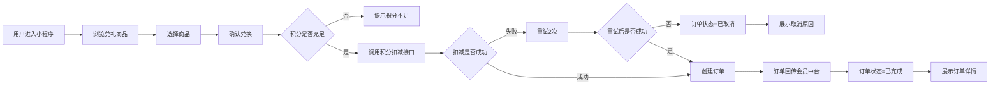

### 2.2 页面列表

#### C端页面（小程序端）

| 页面编号 | 页面名称 | 页面功能 | 用户操作 |
|---------|---------|---------|---------|
| /home | 首页 | 展示活动信息、会员积分、兑礼商品入口 | 浏览、点击进入商品列表 |
| /productList | 商品列表 | 展示所有可兑换商品 | 浏览、筛选、点击进入详情 |
| /productDetail | 商品详情 | 展示商品详细信息、积分价格 | 查看、点击兑换 |
| /confirmExchange | 确认兑换 | 选择收货地址、确认订单信息 | 选择地址、确认兑换 |
| /exchangeResult | 兑换结果 | 展示兑换成功/失败结果 | 查看结果、返回首页/订单 |
| /orderList | 我的订单 | 展示所有兑礼订单列表 | 查看列表、点击进入详情 |
| /orderDetail | 订单详情 | 展示订单详细信息、物流信息 | 查看详情 |

#### B端页面（管理端）

| 页面编号 | 页面名称 | 页面功能 | 用户操作 |
|---------|---------|---------|---------|
| /activityList | 活动列表 | 展示所有兑礼活动 | 查看、搜索、新建、编辑、启用/禁用 |
| /activityEdit | 活动创建/编辑 | 配置活动基础信息、活动规则、装修 | 填写表单、上传素材、保存 |
| /productManage | 商品管理 | 展示从兑礼中台同步的商品 | 查看、同步、上下架配置 |
| /dashboard | 数据看板 | 展示活动曝光、订单报表 | 查看数据、筛选时间范围 |
| /orderManage | 订单管理 | 展示所有兑礼订单 | 查看、搜索、处理异常 |
| /permission | 权限管理 | 管理用户渠道店铺授权 | 查看、授权、取消授权 |

### 2.3 功能列表

#### C端功能

| 功能模块 | 功能点 | 优先级 |
|---------|--------|--------|
| 会员中心 | 积分余额展示 | P0 |
| 会员中心 | 会员等级展示 | P0 |
| 兑礼商城 | 商品列表展示 | P0 |
| 兑礼商城 | 商品详情展示 | P0 |
| 兑礼流程 | 收货地址选择 | P0 |
| 兑礼流程 | 积分扣减 | P0 |
| 订单管理 | 订单列表展示 | P0 |
| 订单管理 | 订单详情展示 | P0 |
| 订单管理 | 物流信息展示 | P1 |

#### B端功能

| 功能模块 | 功能点 | 优先级 |
|---------|--------|--------|
| 活动管理 | 活动创建 | P0 |
| 活动管理 | 活动编辑 | P0 |
| 活动管理 | 活动启用/禁用 | P0 |
| 活动管理 | 多渠道多店铺配置 | P0 |
| 商品管理 | 商品同步 | P0 |
| 商品管理 | 商品上下架 | P0 |
| 数据看板 | 活动曝光数据 | P1 |
| 数据看板 | 兑礼订单报表 | P1 |
| 系统配置 | 渠道店铺权限管理 | P0 |

### 2.4 业务对象

| 业务对象 | 对象属性 |
|---------|---------|
| 用户 | 用户ID、openid、member_code、会员等级、积分余额、注册时间 |
| 活动 | 活动ID、活动名称、活动说明、开始时间、结束时间、渠道、店铺、状态、创建时间 |
| 商品 | 商品ID、商品名称、商品描述、商品图片、所需积分、库存数量、上架状态 |
| 订单 | 订单ID、用户ID、活动ID、商品ID、订单状态、所需积分、收货地址、物流单号、创建时间 |
| 地址 | 地址ID、用户ID、收货人姓名、手机号、省市区、详细地址 |

### 2.5 用户故事

| 故事编号 | 端口 | 用户故事 |
|---------|------|---------|
| S01 | 小程序端 | 作为一个会员，我需要查看我的积分余额和等级，以便了解我能兑换什么礼品 |
| S02 | 小程序端 | 作为一个会员，我需要浏览兑礼商品列表，以便找到感兴趣的礼品 |
| S03 | 小程序端 | 作为一个会员，我需要查看商品详情，以便了解商品信息和所需积分 |
| S04 | 小程序端 | 作为一个会员，我需要选择收货地址并确认兑换，以便完成积分兑礼 |
| S05 | 小程序端 | 作为一个会员，我需要查看我的兑礼订单，以便了解订单状态和物流信息 |
| S06 | 管理端 | 作为一个运营人员，我需要创建兑礼活动，以便在特定时间开展积分兑礼 |
| S07 | 管理端 | 作为一个运营人员，我需要管理活动状态，以便控制活动上线和下线 |
| S08 | 管理端 | 作为一个运营人员，我需要查看数据看板，以便了解活动效果和订单情况 |
| S09 | 管理端 | 作为一个管理员，我需要配置用户权限，以便控制数据访问范围 |

### 2.6 埋点方案

| 事件编号 | 事件名称 | 触发场景 | 埋点字段 |
|---------|---------|---------|---------|
| /home/feat-01 | 小程序曝光 | 用户进入小程序 | 活动ID、用户ID、member_code、曝光时间 |
| /productDetail/feat-01 | 商品浏览 | 用户查看商品详情 | 活动ID、用户ID、member_code、商品ID、浏览时间 |
| /confirmExchange/feat-01 | 兑换成功 | 用户成功完成积分兑换 | 活动ID、用户ID、member_code、商品ID、订单ID、兑换时间 |
| /confirmExchange/feat-02 | 兑换失败 | 用户积分兑换失败 | 活动ID、用户ID、member_code、商品ID、失败原因、失败时间 |
| /orderDetail/feat-01 | 订单查看 | 用户查看订单详情 | 活动ID、用户ID、member_code、订单ID、查看时间 |

### 2.7 异常场景

| 异常编号 | 异常场景 | 触发条件 | 处理方式 | 用户提示 |
|---------|---------|---------|---------|---------|
| /confirmExchange/feat-01/err-01 | 积分不足 | 用户积分小于商品所需积分 | 前端拦截，不创建订单 | 积分不足，无法兑换 |
| /confirmExchange/feat-01/err-02 | 积分扣减失败 | 3.2.9接口失败或3.2.16查询失败 | 重试2次，失败则订单取消 | 兑换失败，积分扣减失败 |
| /confirmExchange/feat-01/err-03 | 订单同步失败 | 订单回传会员中台失败 | 钉钉预警，人工运维重推 | 用户端无感知 |
| /productList/feat-01/err-01 | 商品同步失败 | 从兑礼中台获取商品信息失败 | 钉钉预警，人工介入处理 | 用户端无感知 |
| /confirmExchange/feat-01/err-04 | 地址获取失败 | 淘宝地址接口调用失败 | 提示用户手动输入地址 | 地址获取失败，请手动输入 |

## 5. 原型与交互

### 5.1 原型索引

| 页面编号 | 页面名称 | 原型链接 |
|---------|---------|---------|
| /home | 首页 | [Penpot原型](https://design.penpot.app/#/workspace?team-id=30c95215-44cf-80fa-8007-dfa01ff106f5&file-id=95ecf5e0-91fe-80de-8007-f40e3e90b1e1) |
| /productList | 商品列表 | [Penpot原型](https://design.penpot.app/#/workspace?team-id=30c95215-44cf-80fa-8007-dfa01ff106f5&file-id=95ecf5e0-91fe-80de-8007-f40e3e90b1e1) |
| /productDetail | 商品详情 | [Penpot原型](https://design.penpot.app/#/workspace?team-id=30c95215-44cf-80fa-8007-dfa01ff106f5&file-id=95ecf5e0-91fe-80de-8007-f40e3e90b1e1) |
| /confirmExchange | 确认兑换 | [Penpot原型](https://design.penpot.app/#/workspace?team-id=30c95215-44cf-80fa-8007-dfa01ff106f5&file-id=95ecf5e0-91fe-80de-8007-f40e3e90b1e1) |
| /exchangeResult | 兑换结果 | [Penpot原型](https://design.penpot.app/#/workspace?team-id=30c95215-44cf-80fa-8007-dfa01ff106f5&file-id=95ecf5e0-91fe-80de-8007-f40e3e90b1e1) |
| /orderList | 我的订单 | [Penpot原型](https://design.penpot.app/#/workspace?team-id=30c95215-44cf-80fa-8007-dfa01ff106f5&file-id=95ecf5e0-91fe-80de-8007-f40e3e90b1e1) |
| /orderDetail | 订单详情 | [Penpot原型](https://design.penpot.app/#/workspace?team-id=30c95215-44cf-80fa-8007-dfa01ff106f5&file-id=95ecf5e0-91fe-80de-8007-f40e3e90b1e1) |
| /activityList | 活动列表 | [Penpot原型](https://design.penpot.app/#/workspace?team-id=30c95215-44cf-80fa-8007-dfa01ff106f5&file-id=95ecf5e0-91fe-80de-8007-f40e3e90b1e1) |
| /activityEdit | 活动编辑 | [Penpot原型](https://design.penpot.app/#/workspace?team-id=30c95215-44cf-80fa-8007-dfa01ff106f5&file-id=95ecf5e0-91fe-80de-8007-f40e3e90b1e1) |

### 5.2 页面原型引用

**Penpot项目链接**: https://design.penpot.app/#/workspace?team-id=30c95215-44cf-80fa-8007-dfa01ff106f5&file-id=95ecf5e0-91fe-80de-8007-f40e3e90b1e1

- 用户故事页面: 已绘制5个用户故事（S01, S02, S04, S05, S06）
- PRD详细设计页面: 待绘制（Penpot MCP工具暂时不可用）
- 原型页面: 待绘制

## 6. 变更记录

## 3. 详细设计

### 3.1 用户故事拆分

#### 3.1.1 Epic级需求梳理

| Epic编号 | Epic名称 | 描述 | 关联用户故事 |
|---------|---------|------|------------|
| EP-001 | 会员积分感知 | 让会员清晰感知积分价值和兑换能力 | S01 |
| EP-002 | 兑礼商品浏览 | 提供便捷的商品浏览和筛选体验 | S02, S03 |
| EP-003 | 积分兑礼流程 | 完整的积分兑换流程，从选择到完成 | S04 |
| EP-004 | 订单管理 | 订单查询和物流跟踪 | S05 |
| EP-005 | 活动运营管理 | 多渠道多店铺的活动配置和管理 | S06, S07 |
| EP-006 | 数据监控 | 活动效果监控和异常预警 | S08 |
| EP-007 | 权限管理 | 用户渠道店铺数据权限控制 | S09 |

#### 3.1.2 用户故事拆分

| 故事ID | 用户角色 | 用户故事描述 | 验收标准 | 优先级 |
|--------|----------|--------------|----------|--------|
| US-001 | 会员用户 | 作为一个会员，我需要查看我的积分余额和等级，以便了解我能兑换什么礼品 | 1. 首页展示积分余额和等级 2. 点击可查看积分明细 | Must have |
| US-002 | 会员用户 | 作为一个会员，我需要浏览兑礼商品列表，以便找到感兴趣的礼品 | 1. 商品列表支持分类筛选 2. 展示商品图片、名称、所需积分 | Must have |
| US-003 | 会员用户 | 作为一个会员，我需要查看商品详情，以便了解商品信息和所需积分 | 1. 展示商品详细信息 2. 展示所需积分和库存 | Must have |
| US-004 | 会员用户 | 作为一个会员，我需要选择收货地址并确认兑换，以便完成积分兑礼 | 1. 支持选择淘宝地址 2. 积分充足时确认兑换 3. 兑换成功生成订单 | Must have |
| US-005 | 会员用户 | 作为一个会员，我需要查看我的兑礼订单，以便了解订单状态和物流信息 | 1. 订单列表展示所有订单 2. 订单详情展示物流信息 | Must have |
| US-006 | 运营人员 | 作为一个运营人员，我需要创建兑礼活动，以便在特定时间开展积分兑礼 | 1. 支持活动基础配置 2. 支持活动装修配置 3. 支持商品绑定 | Must have |
| US-007 | 运营人员 | 作为一个运营人员，我需要管理活动状态，以便控制活动上线和下线 | 1. 支持启用/禁用活动 2. 活动状态实时生效 | Must have |
| US-008 | 运营人员 | 作为一个运营人员，我需要查看数据看板，以便了解活动效果和订单情况 | 1. 实时展示活动曝光数据 2. 展示兑礼订单报表 | Should have |
| US-009 | 系统管理员 | 作为一个管理员，我需要配置用户权限，以便控制数据访问范围 | 1. 支持多渠道多店铺授权 2. 数据权限隔离 | Must have |

### 3.2 业务流程图和页面流程图

#### 3.2.1 业务流程图

**C端核心业务流程：**

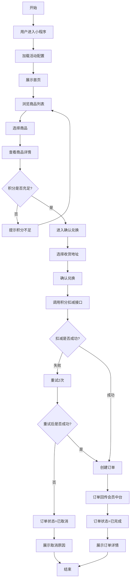

**B端活动管理流程：**

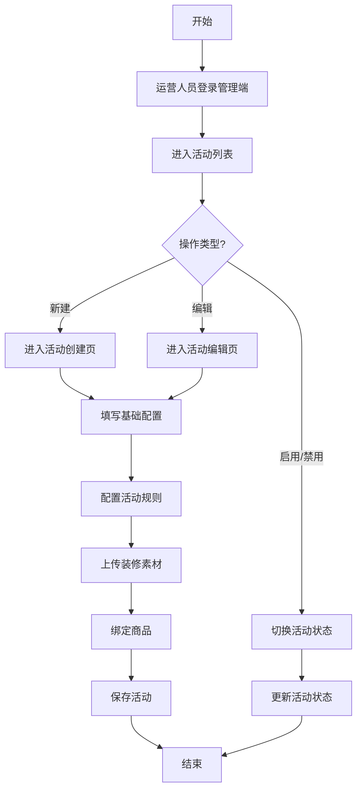

#### 3.2.2 页面流程图

**C端页面流程：**
```
首页(/home) → 商品列表(/productList) → 商品详情(/productDetail) → 确认兑换(/confirmExchange) → 兑换结果(/exchangeResult) → 订单列表(/orderList) → 订单详情(/orderDetail)
```

**B端页面流程：**
```
活动列表(/activityList) → 活动创建/编辑(/activityEdit)
商品管理(/productManage)
数据看板(/dashboard)
订单管理(/orderManage)
权限管理(/permission)
```

### 3.3 页面列表整合

#### 3.3.1 C端页面列表

| 页面ID | 页面名称 | 所属模块 | 功能描述 | 关联用户故事 |
|--------|----------|----------|----------|--------------|
| /home | 首页 | 基础模块 | 展示活动信息、会员积分、快捷入口 | US-001 |
| /productList | 商品列表页 | 商品模块 | 展示商品列表、支持分类筛选 | US-002 |
| /productDetail | 商品详情页 | 商品模块 | 展示商品详情、兑换按钮 | US-003 |
| /confirmExchange | 确认兑换页 | 订单模块 | 选择地址、确认兑换、积分扣减 | US-004 |
| /exchangeResult | 兑换结果页 | 订单模块 | 展示兑换成功/失败结果 | US-004 |
| /orderList | 订单列表页 | 订单模块 | 展示所有兑礼订单 | US-005 |
| /orderDetail | 订单详情页 | 订单模块 | 展示订单详情、物流信息 | US-005 |

#### 3.3.2 B端页面列表

| 页面ID | 页面名称 | 所属模块 | 功能描述 | 关联用户故事 |
|--------|----------|----------|----------|--------------|
| /activityList | 活动列表页 | 活动模块 | 活动查询、新建、编辑、启用/禁用 | US-006, US-007 |
| /activityEdit | 活动编辑页 | 活动模块 | 活动基础配置、规则配置、装修配置 | US-006 |
| /productManage | 商品管理页 | 商品模块 | 商品同步、上下架配置 | US-006 |
| /dashboard | 数据看板页 | 数据模块 | 活动曝光、订单报表 | US-008 |
| /orderManage | 订单管理页 | 订单模块 | 订单查询、异常处理 | US-008 |
| /permission | 权限管理页 | 系统模块 | 用户渠道店铺授权 | US-009 |

### 3.4 页面结构和事件定义

#### 3.4.1 首页 (/home)

##### 页面结构定义
```
- 顶部区域：
  - 活动背景图（可配置）
  - 活动标题和说明
- 会员信息区域：
  - 会员等级展示
  - 积分余额展示
  - 积分明细入口
- 商品入口区域：
  - 兑礼商品入口按钮
  - 我的订单入口按钮
- 底部区域：
  - 活动规则说明
```

##### 事件列表

| 事件编号 | 事件名称 | 绑定页面 | 触发节点 | 事件描述 | 关联用户故事 |
|---------|---------|---------|---------|---------|--------------|
| /home/feat-01 | 查询会员信息 | 首页 | 载入时 | 用户进入小程序时查询会员积分和等级 | US-001 |
| /home/feat-02 | 加载活动配置 | 首页 | 载入时 | 加载当前活动背景图、标题等配置 | US-001 |
| /home/feat-03 | 进入商品列表 | 首页 | 点击商品入口 | 用户点击兑礼商品入口，跳转到商品列表 | US-002 |
| /home/feat-04 | 进入订单列表 | 首页 | 点击订单入口 | 用户点击我的订单入口，跳转到订单列表 | US-005 |

##### 事件逻辑

**事件 /home/feat-01 查询会员信息**
1. 业务流程图：
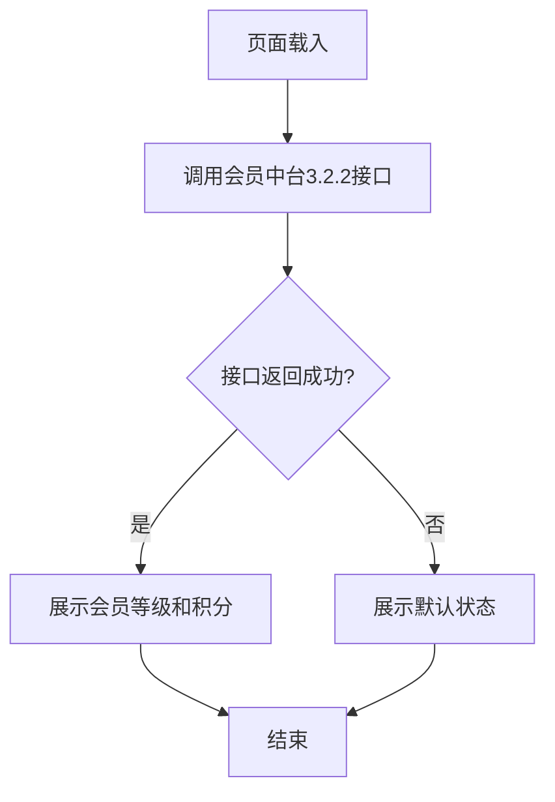
2. 接口交互：
   - **接口：会员中台 3.2.2 会员信息查询**
     - 请求方式：GET
     - 请求参数：member_code（会员编码，从小程序上下文获取）
     - 返回数据：member_level（会员等级）、points_balance（积分余额）、member_name（会员姓名）
     - 成功判断：返回码 = 200 且 points_balance >= 0
3. 异常处理：
   - 接口失败：展示默认状态（等级显示"普通会员"、积分显示"--"），不阻断用户操作

#### 3.4.2 商品列表页 (/productList)

##### 页面结构定义
```
- 顶部导航栏：
  - 返回按钮
  - 页面标题"兑礼商品"
- 筛选区域：
  - 分类筛选标签
  - 排序选项（积分从低到高/高到低）
- 商品列表区域：
  - 商品卡片（图片、名称、所需积分、库存状态）
  - 支持下拉刷新和上拉加载
- 底部区域：
  - 无更多数据提示
```

##### 事件列表

| 事件编号 | 事件名称 | 绑定页面 | 触发节点 | 事件描述 | 关联用户故事 |
|---------|---------|---------|---------|---------|--------------|
| /productList/feat-01 | 加载商品列表 | 商品列表 | 载入时/下拉刷新 | 从兑礼中台加载商品列表 | US-002 |
| /productList/feat-02 | 筛选商品 | 商品列表 | 点击分类标签 | 按分类筛选商品 | US-002 |
| /productList/feat-03 | 排序商品 | 商品列表 | 点击排序选项 | 按积分价格排序 | US-002 |
| /productList/feat-04 | 进入商品详情 | 商品列表 | 点击商品卡片 | 跳转到商品详情页 | US-003 |

##### 事件逻辑

**事件 /productList/feat-01 加载商品列表**
1. 业务流程图：
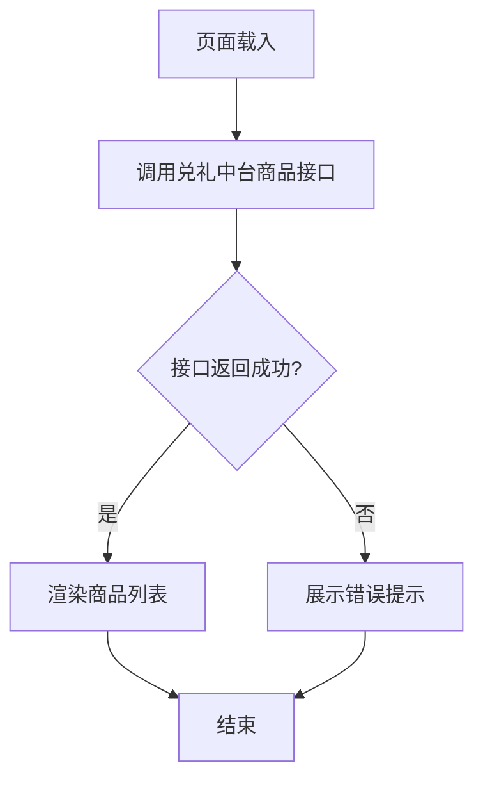
2. 接口交互：
   - **接口：兑礼中台商品列表查询**
     - 请求方式：GET
     - 请求参数：activity_id（活动ID）、category_id（分类ID，可为空）、page（页码，从1开始）、page_size（每页数量，默认20）
     - 返回数据：products[]（商品列表，每项包含 product_id、name、image_url、points_price、stock_status）、total_count（总数量）、page（当前页）、page_size（每页数量）
     - 成功判断：返回码 = 200 且 products.length >= 0
3. 异常处理：
   - 接口失败：展示"商品加载失败，请重试"，提供重试按钮
   - 数据为空：展示空状态插图和"暂无商品"文案

#### 3.4.3 商品详情页 (/productDetail)

##### 页面结构定义
```
- 顶部导航栏：
  - 返回按钮
  - 分享按钮
- 商品信息区域：
  - 商品图片轮播
  - 商品名称
  - 商品描述
  - 所需积分
  - 库存状态
- 兑换操作区域：
  - 兑换按钮（积分不足时禁用）
- 商品详情区域：
  - 图文详情
```

##### 事件列表

| 事件编号 | 事件名称 | 绑定页面 | 触发节点 | 事件描述 | 关联用户故事 |
|---------|---------|---------|---------|---------|--------------|
| /productDetail/feat-01 | 加载商品详情 | 商品详情 | 载入时 | 加载商品详细信息 | US-003 |
| /productDetail/feat-02 | 点击兑换 | 商品详情 | 点击兑换按钮 | 校验积分后进入确认兑换页 | US-004 |

##### 事件逻辑

**事件 /productDetail/feat-01 加载商品详情**
1. 业务流程图：
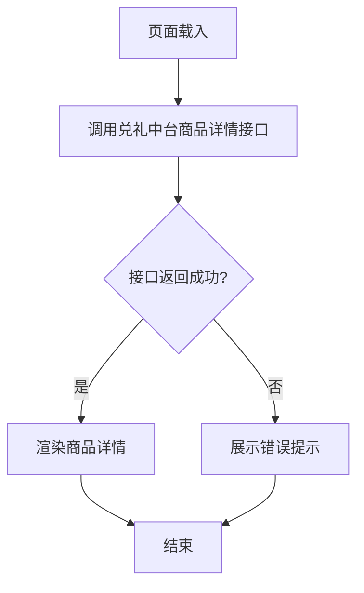
2. 接口交互：
   - **接口：兑礼中台商品详情查询**
     - 请求方式：GET
     - 请求参数：product_id（商品ID，从页面入参获取）
     - 返回数据：product_id、name、description、images[]（图片列表）、points_price（所需积分）、stock_status（库存状态：IN_STOCK/OUT_OF_STOCK）、detail_html（图文详情HTML）
     - 成功判断：返回码 = 200 且 product_id 存在
3. 异常处理：
   - 接口失败：展示"商品信息加载失败"，提供返回按钮

**事件 /productDetail/feat-02 点击兑换**
1. 业务流程图：
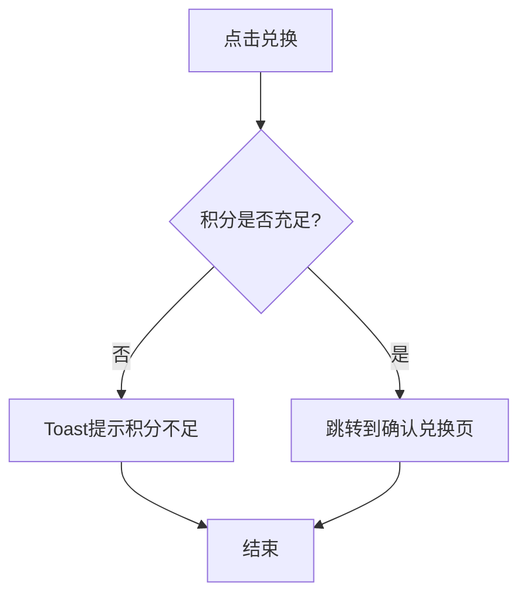
2. 前置校验：
   - 校验用户积分 >= 商品所需积分（积分数据从/home/feat-01缓存获取）
   - 校验商品库存 > 0（库存数据从/productDetail/feat-01缓存获取）
3. 异常处理：
   - 积分不足：Toast提示"积分不足，无法兑换"，按钮保持禁用
   - 库存不足：Toast提示"商品库存不足"，按钮保持禁用

#### 3.4.4 确认兑换页 (/confirmExchange)

##### 页面结构定义
```
- 顶部导航栏：
  - 返回按钮
  - 页面标题"确认兑换"
- 商品信息区域：
  - 商品缩略图
  - 商品名称
  - 所需积分
- 地址选择区域：
  - 默认收货地址展示
  - 更换地址按钮
- 积分信息区域：
  - 当前积分
  - 所需积分
  - 兑换后剩余积分
- 操作区域：
  - 确认兑换按钮
```

##### 事件列表

| 事件编号 | 事件名称 | 绑定页面 | 触发节点 | 事件描述 | 关联用户故事 |
|---------|---------|---------|---------|---------|--------------|
| /confirmExchange/feat-01 | 加载地址列表 | 确认兑换 | 载入时 | 调用淘宝接口获取用户地址 | US-004 |
| /confirmExchange/feat-02 | 选择地址 | 确认兑换 | 点击地址 | 选择其他收货地址 | US-004 |
| /confirmExchange/feat-03 | 确认兑换 | 确认兑换 | 点击确认按钮 | 调用积分扣减接口，创建订单 | US-004 |

##### 事件逻辑

**事件 /confirmExchange/feat-01 加载地址列表**
1. 业务流程图：
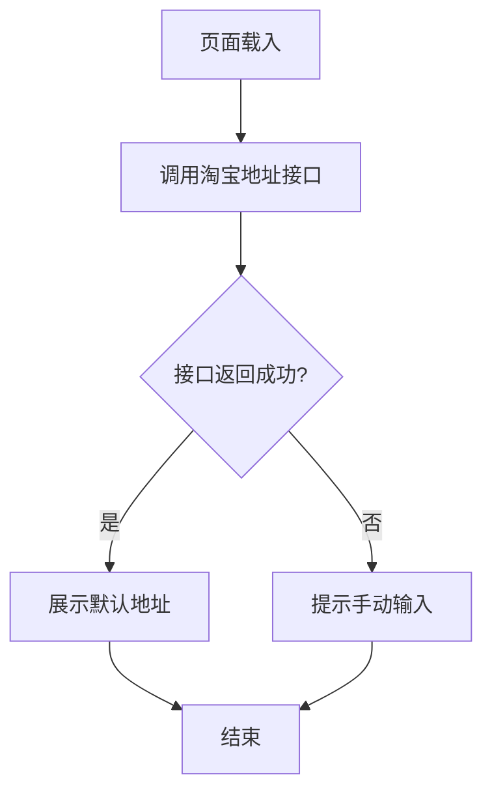
2. 接口交互：
   - **接口：淘宝地址查询接口**
     - 请求方式：GET
     - 请求参数：user_id（用户ID，从小程序上下文获取）
     - 返回数据：addresses[]（地址列表，每项包含 address_id、receiver_name、phone、province、city、district、detail_address、is_default）、default_address_id（默认地址ID）
     - 成功判断：返回码 = 200 且 addresses.length > 0
3. 异常处理：
   - 接口失败：Toast提示"地址获取失败，请手动输入收货地址"，显示手动输入表单

**事件 /confirmExchange/feat-02 选择地址**
1. 业务流程图：
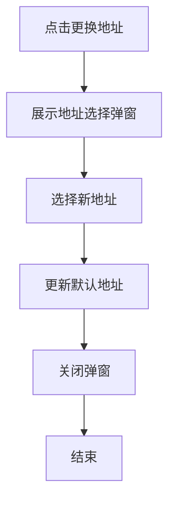
2. 接口交互：
   - **接口：本地地址缓存更新**
     - 请求方式：POST
     - 请求参数：address_id（选择的地址ID）
     - 返回数据：success（更新是否成功）
     - 成功判断：success = true
3. 异常处理：
   - 选择失败：保持原地址不变，Toast提示"地址选择失败"

**事件 /confirmExchange/feat-03 确认兑换**
1. 业务流程图：
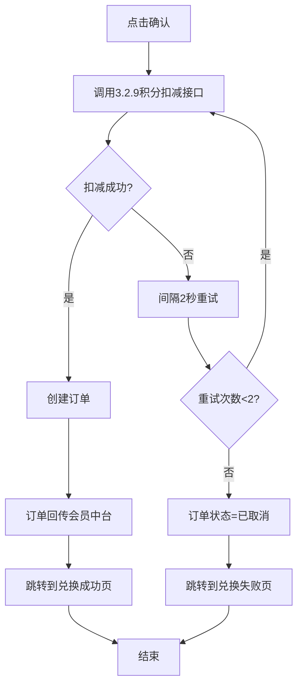
2. 接口交互：
   - **接口1：会员中台 3.2.9 积分扣减**
     - 请求方式：POST
     - 请求参数：member_code, points, biz_type, biz_id
     - 返回数据：sequence_code, result_code
     - 成功判断：result_code = SUCCESS
   - **接口2：会员中台 3.2.16 查询扣减结果**
     - 请求方式：POST
     - 请求参数：sequence_code
     - 返回数据：status, points_balance
     - 成功判断：status = SUCCESS
   - **接口3：创建订单接口**
     - 请求方式：POST
     - 请求参数：user_id, activity_id, product_id, address_id, points
     - 返回数据：order_id, order_status
     - 成功判断：order_status = CREATED
   - **接口4：订单回传会员中台**
     - 请求方式：POST
     - 请求参数：member_code, order_id, points, biz_type
     - 返回数据：result_code
     - 成功判断：result_code = SUCCESS
3. 异常处理：
   - 扣减失败：订单状态标记为"已取消"，展示"兑换失败，积分扣减失败"
   - 订单同步失败：钉钉预警，人工运维重推

#### 3.4.5 兑换结果页 (/exchangeResult)

##### 页面结构定义
```
- 结果展示区域：
  - 成功/失败图标
  - 结果标题（兑换成功/兑换失败）
  - 结果说明
- 订单信息区域（成功时）：
  - 订单号
  - 商品信息
  - 消耗积分
- 操作区域：
  - 查看订单按钮
  - 返回首页按钮
```

##### 事件列表

| 事件编号 | 事件名称 | 绑定页面 | 触发节点 | 事件描述 | 关联用户故事 |
|---------|---------|---------|---------|---------|--------------|
| /exchangeResult/feat-01 | 查看订单 | 兑换结果 | 点击查看订单 | 跳转到订单详情 | US-005 |
| /exchangeResult/feat-02 | 返回首页 | 兑换结果 | 点击返回首页 | 跳转到首页 | US-001 |

##### 事件逻辑

**事件 /exchangeResult/feat-01 查看订单**
1. 业务流程图：
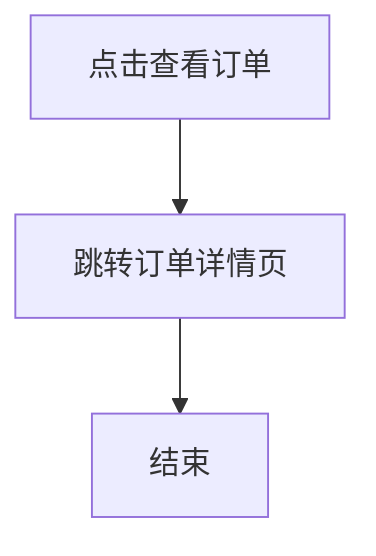
2. 接口交互：
   - 无后端接口，纯前端跳转
   - 跳转参数：order_id（从页面入参获取）
3. 异常处理：
   - 无异常场景

**事件 /exchangeResult/feat-02 返回首页**
1. 业务流程图：
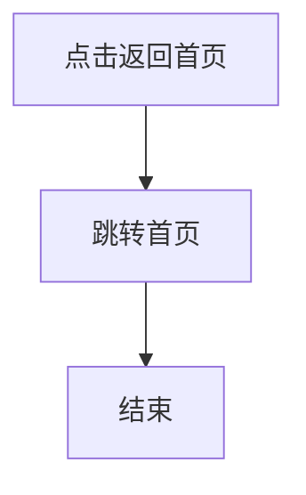
2. 接口交互：
   - 无后端接口，纯前端跳转
3. 异常处理：
   - 无异常场景

#### 3.4.6 订单列表页 (/orderList)

##### 页面结构定义
```
- 顶部导航栏：
  - 返回按钮
  - 页面标题"我的订单"
- 订单列表区域：
  - 订单卡片（商品图片、名称、订单状态、订单时间）
  - 支持下拉刷新和上拉加载
- 空状态区域：
  - 无订单时展示空状态
```

##### 事件列表

| 事件编号 | 事件名称 | 绑定页面 | 触发节点 | 事件描述 | 关联用户故事 |
|---------|---------|---------|---------|---------|--------------|
| /orderList/feat-01 | 加载订单列表 | 订单列表 | 载入时/下拉刷新 | 加载用户兑礼订单 | US-005 |
| /orderList/feat-02 | 进入订单详情 | 订单列表 | 点击订单卡片 | 跳转到订单详情页 | US-005 |

##### 事件逻辑

**事件 /orderList/feat-01 加载订单列表**
1. 业务流程图：
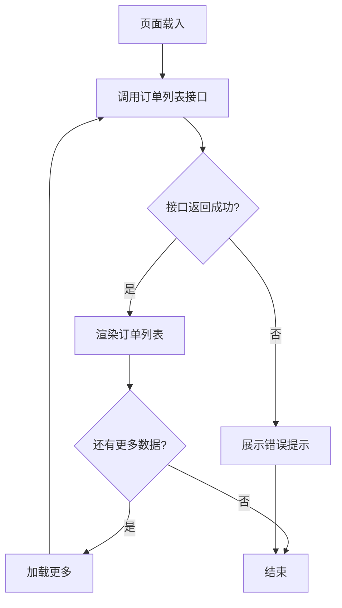
2. 接口交互：
   - **接口：本系统订单列表查询**
     - 请求方式：GET
     - 请求参数：user_id（用户ID）、page（页码，从1开始）、page_size（每页数量，默认20）
     - 返回数据：orders[]（订单列表，每项包含 order_id、product_name、product_image、order_status、points_cost、create_time）、total_count（总数量）、has_more（是否有更多）
     - 成功判断：返回码 = 200 且 orders.length >= 0
3. 异常处理：
   - 接口失败：展示"订单加载失败，请重试"，提供重试按钮
   - 数据为空：展示空状态插图和"暂无订单记录"文案

**事件 /orderList/feat-02 进入订单详情**
1. 业务流程图：
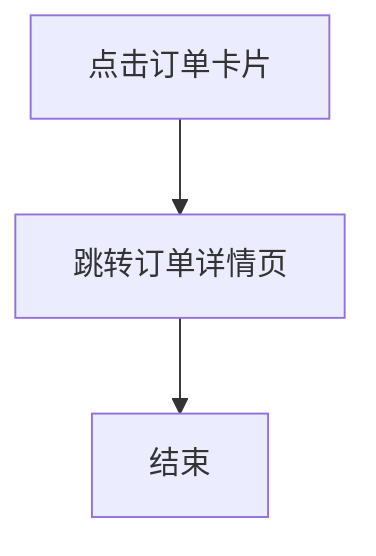
2. 接口交互：
   - 无后端接口，纯前端跳转
   - 跳转参数：order_id（从点击的订单卡片获取）
3. 异常处理：
   - 无异常场景

#### 3.4.7 订单详情页 (/orderDetail)

##### 页面结构定义
```
- 顶部导航栏：
  - 返回按钮
  - 页面标题"订单详情"
- 订单状态区域：
  - 订单状态标签（已完成/已取消）
  - 状态说明
- 商品信息区域：
  - 商品图片
  - 商品名称
  - 所需积分
- 收货地址区域：
  - 收货人姓名
  - 手机号
  - 详细地址
- 物流信息区域（已完成时）：
  - 物流供应商
  - 物流单号
- 订单信息区域：
  - 订单号
  - 创建时间
  - 取消原因（已取消时）
```

##### 事件列表

| 事件编号 | 事件名称 | 绑定页面 | 触发节点 | 事件描述 | 关联用户故事 |
|---------|---------|---------|---------|---------|--------------|
| /orderDetail/feat-01 | 加载订单详情 | 订单详情 | 载入时 | 加载订单详细信息和物流信息 | US-005 |

##### 事件逻辑

**事件 /orderDetail/feat-01 加载订单详情**
1. 业务流程图：
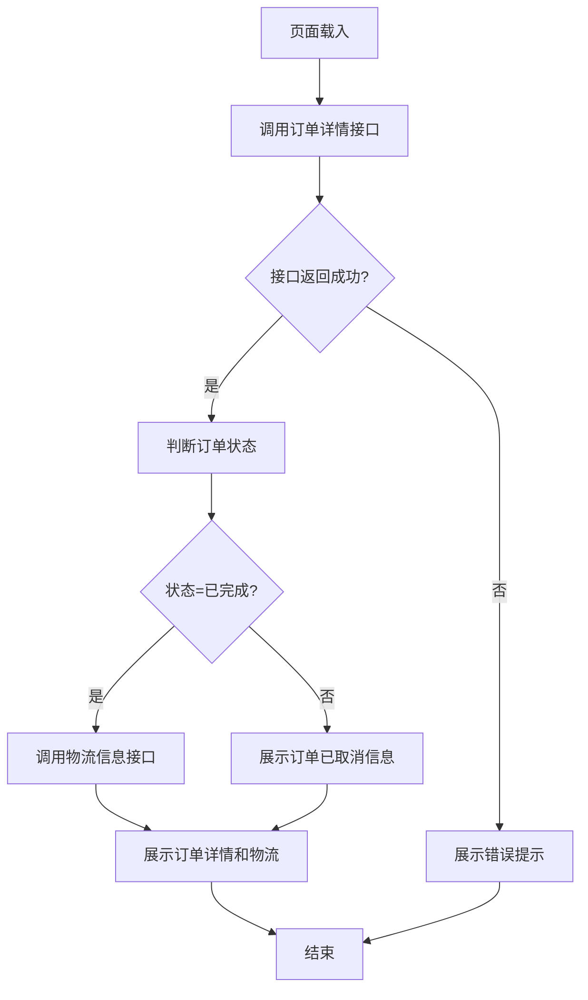
2. 接口交互：
   - **接口1：本系统订单详情查询**
     - 请求方式：GET
     - 请求参数：order_id（订单ID，从页面入参获取）
     - 返回数据：order_id、product_name、product_image、points_cost、order_status、create_time、cancel_reason（已取消时）、address_id
     - 成功判断：返回码 = 200 且 order_id 存在
   - **接口2：兑礼中台物流查询**（仅已完成订单）
     - 请求方式：GET
     - 请求参数：order_id（订单ID）
     - 返回数据：logistics_company（物流供应商）、tracking_number（物流单号）
     - 成功判断：返回码 = 200
3. 异常处理：
   - 订单不存在：展示"订单不存在"，提供返回按钮
   - 物流查询失败：物流信息区域展示"物流信息加载中"，前端定时拉取（最多3次，间隔5秒）

#### 3.4.8 活动列表页 (/activityList)

##### 页面结构定义
```
- 顶部导航栏：
  - 页面标题"活动管理"
  - 新建活动按钮
- 搜索区域：
  - 活动名称搜索框
- 活动列表区域：
  - 活动卡片（名称、时间、状态、渠道、店铺）
  - 操作按钮（编辑、启用/禁用）
- 分页区域：
  - 分页控件
```

##### 事件列表

| 事件编号 | 事件名称 | 绑定页面 | 触发节点 | 事件描述 | 关联用户故事 |
|---------|---------|---------|---------|---------|--------------|
| /activityList/feat-01 | 加载活动列表 | 活动列表 | 载入时/搜索 | 加载活动列表 | US-007 |
| /activityList/feat-02 | 新建活动 | 活动列表 | 点击新建按钮 | 跳转到活动创建页 | US-006 |
| /activityList/feat-03 | 编辑活动 | 活动列表 | 点击编辑按钮 | 跳转到活动编辑页 | US-006 |
| /activityList/feat-04 | 切换活动状态 | 活动列表 | 点击启用/禁用 | 切换活动状态 | US-007 |

##### 事件逻辑

**事件 /activityList/feat-01 加载活动列表**
1. 业务流程图：
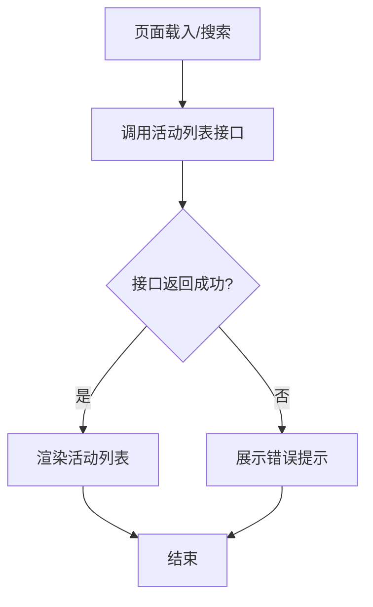
2. 接口交互：
   - **接口：本系统活动列表查询**
     - 请求方式：GET
     - 请求参数：search_keyword（搜索关键词，可为空）、page（页码）、page_size（每页数量）
     - 返回数据：activities[]（活动列表，每项包含 activity_id、name、start_time、end_time、status、channel_name、shop_name）、total_count、page、page_size
     - 成功判断：返回码 = 200
3. 异常处理：
   - 接口失败：展示"活动列表加载失败"，提供刷新按钮

**事件 /activityList/feat-02 新建活动**
1. 业务流程图：
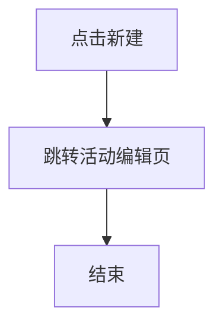
2. 接口交互：
   - 无后端接口，纯前端跳转
3. 异常处理：
   - 无异常场景

**事件 /activityList/feat-03 编辑活动**
1. 业务流程图：
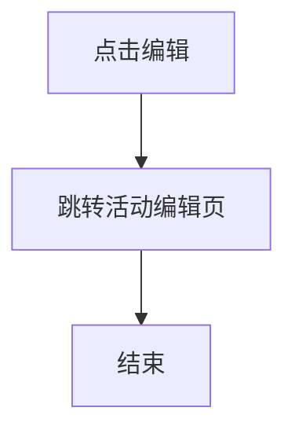
2. 接口交互：
   - 无后端接口，纯前端跳转
   - 跳转参数：activity_id
3. 异常处理：
   - 无异常场景

**事件 /activityList/feat-04 切换活动状态**
1. 业务流程图：
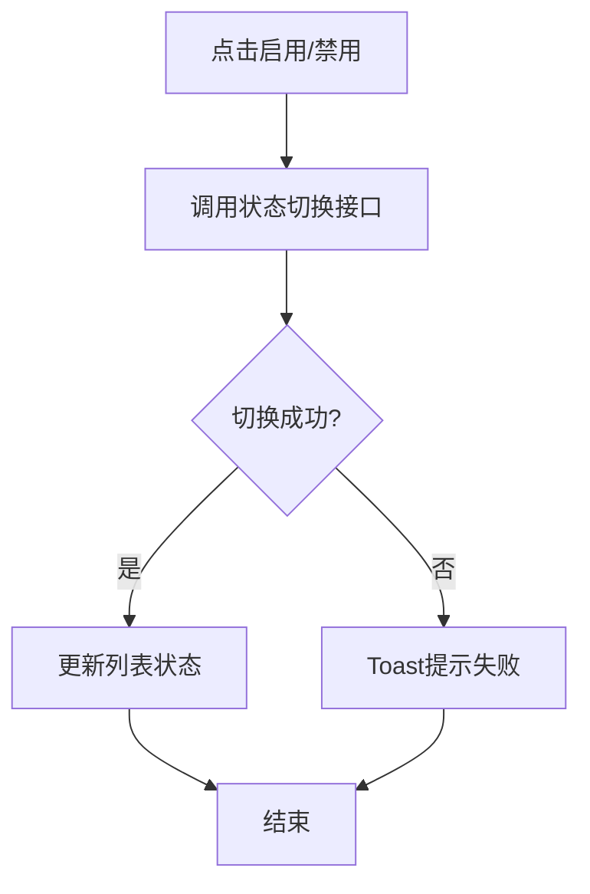
2. 接口交互：
   - **接口：本系统活动状态切换**
     - 请求方式：POST
     - 请求参数：activity_id、new_status（ENABLED/DISABLED）
     - 返回数据：success、activity_id、current_status
     - 成功判断：success = true
3. 异常处理：
   - 切换失败：Toast提示"操作失败，请重试"，恢复按钮原状态

#### 3.4.9 活动编辑页 (/activityEdit)

##### 页面结构定义
```
- 顶部导航栏：
  - 返回按钮
  - 页面标题"创建活动"/"编辑活动"
  - 保存按钮
- 表单区域：
  - 基础配置：活动名称、活动说明、开始时间、结束时间
  - 活动配置：关联兑礼中台活动、商品绑定
  - 装修配置：背景图上传、热区配置
- 底部区域：
  - 保存按钮
```

##### 事件列表

| 事件编号 | 事件名称 | 绑定页面 | 触发节点 | 事件描述 | 关联用户故事 |
|---------|---------|---------|---------|---------|--------------|
| /activityEdit/feat-01 | 加载活动详情 | 活动编辑 | 载入时 | 加载活动详情（编辑时） | US-006 |
| /activityEdit/feat-02 | 保存活动 | 活动编辑 | 点击保存 | 保存活动配置 | US-006 |
| /activityEdit/feat-03 | 关联兑礼活动 | 活动编辑 | 选择兑礼活动 | 从兑礼中台选择活动 | US-006 |
| /activityEdit/feat-04 | 上传装修素材 | 活动编辑 | 点击上传 | 上传背景图等素材 | US-006 |

##### 事件逻辑

**事件 /activityEdit/feat-01 加载活动详情**
1. 业务流程图：
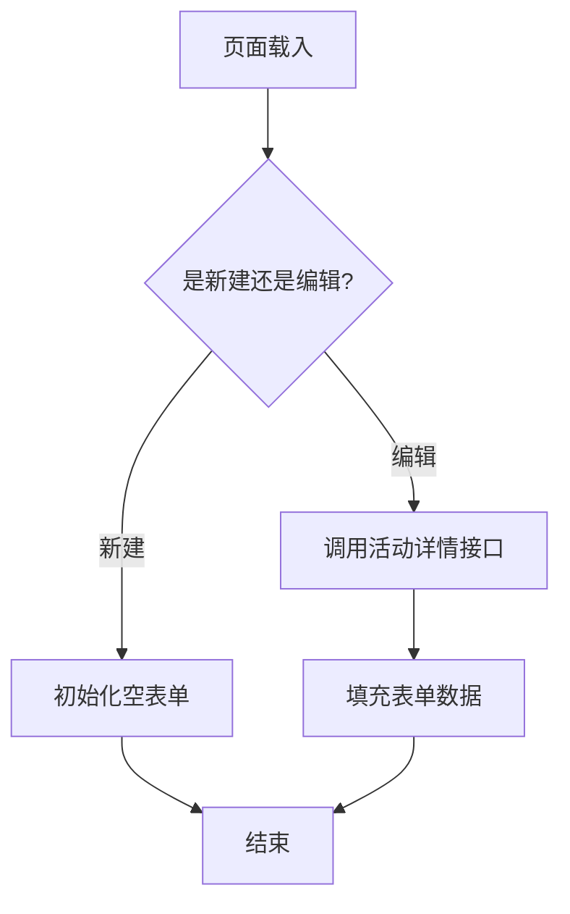
2. 接口交互：
   - **接口：本系统活动详情查询**（仅编辑模式）
     - 请求方式：GET
     - 请求参数：activity_id
     - 返回数据：activity_id、name、description、start_time、end_time、linked_activity_id、product_ids[]、background_image_url、hotspots[]
     - 成功判断：返回码 = 200
3. 异常处理：
   - 加载失败：Toast提示"活动信息加载失败"，返回活动列表页

**事件 /activityEdit/feat-02 保存活动**
1. 业务流程图：
```mermaid
graph TD
    A[点击保存] --> B[表单校验]
    B --> C{校验通过?}
    C -->|否| D[展示校验错误]
    C -->|是| E[调用保存接口]
    E --> F{保存成功?}
    F -->|是| G[跳转活动列表]
    F -->|否| H[Toast提示失败]
    D --> I[结束]
    G --> I
    H --> I
```
2. 接口交互：
   - **接口：本系统活动创建/编辑**
     - 请求方式：POST
     - 请求参数：name、description、start_time、end_time、linked_activity_id、product_ids[]、background_image_url
     - 返回数据：success、activity_id（新建时）
     - 成功判断：success = true
3. 异常处理：
   - 保存失败：Toast提示"保存失败，请重试"，不关闭页面
   - 活动名称重复：Toast提示"活动名称已存在，请修改"

**事件 /activityEdit/feat-03 关联兑礼活动**
1. 业务流程图：
```mermaid
graph TD
    A[点击选择] --> B[调用兑礼中台活动列表]
    B --> C[展示活动选择弹窗]
    C --> D[选择活动]
    D --> E[获取该活动商品列表]
    E --> F[更新商品绑定区域]
    F --> G[结束]
```
2. 接口交互：
   - **接口：兑礼中台活动列表查询**
     - 请求方式：GET
     - 请求参数：无（获取所有可关联活动）
     - 返回数据：activities[]（包含 activity_id、name、status）
     - 成功判断：返回码 = 200
3. 异常处理：
   - 获取失败：Toast提示"获取兑礼活动失败，请重试"

**事件 /activityEdit/feat-04 上传装修素材**
1. 业务流程图：
```mermaid
graph TD
    A[选择图片] --> B[调用文件上传接口]
    B --> C{上传成功?}
    C -->|是| D[获取图片URL]
    D --> E[预览图片]
    C -->|否| F[Toast提示失败]
    E --> G[结束]
    F --> G
```
2. 接口交互：
   - **接口：本系统文件上传**
     - 请求方式：POST（multipart/form-data）
     - 请求参数：file（图片文件，支持jpg/png/webp，单张不超过2MB）
     - 返回数据：url（图片访问地址）、file_id
     - 成功判断：返回码 = 200 且 url 存在
3. 异常处理：
   - 上传失败：Toast提示"上传失败，请重试"
   - 文件格式错误：Toast提示"仅支持jpg、png、webp格式"
   - 文件大小超限：Toast提示"图片大小不能超过2MB"

### 3.5 埋点方案细化

| 事件编号 | 事件名称 | 触发场景 | 埋点字段 | 数据用途 |
|---------|---------|---------|---------|---------|
| /home/feat-01 | 小程序曝光 | 用户进入小程序 | 活动ID、用户ID、member_code、曝光时间 | 统计活动访问量 |
| /productList/feat-01 | 商品列表加载 | 商品列表页载入 | 活动ID、用户ID、分类ID、加载时间 | 分析商品浏览行为 |
| /productDetail/feat-01 | 商品浏览 | 用户查看商品详情 | 活动ID、用户ID、member_code、商品ID、浏览时间 | 统计商品热度 |
| /confirmExchange/feat-03 | 兑换成功 | 用户成功完成积分兑换 | 活动ID、用户ID、member_code、商品ID、订单ID、兑换时间、消耗积分 | 统计兑换转化率 |
| /confirmExchange/feat-02 | 兑换失败 | 用户积分兑换失败 | 活动ID、用户ID、member_code、商品ID、失败原因、失败时间 | 分析失败原因 |
| /orderDetail/feat-01 | 订单查看 | 用户查看订单详情 | 活动ID、用户ID、member_code、订单ID、查看时间 | 分析订单查询行为 |
| /activityList/feat-04 | 活动状态切换 | 运营人员切换活动状态 | 活动ID、操作人ID、原状态、新状态、操作时间 | 审计活动操作 |

### 3.6 数据逻辑定义

#### 3.6.1 订单状态机

```mermaid
graph TD
    A[待处理] --> B[处理中]
    B --> C[已完成]
    B --> D[已取消]
    D --> E[取消原因: 积分扣减失败]
    D --> F[取消原因: 用户取消]
    D --> G[取消原因: 库存不足]
```

#### 3.6.2 积分扣减状态机

```mermaid
graph TD
    A[扣减中] --> B{扣减结果?}
    B -->|成功| C[扣减成功]
    B -->|失败| D[重试中]
    D --> E{重试次数<2?}
    E -->|是| A
    E -->|否| F[扣减失败]
```

### 3.7 接口清单

| 接口编号 | 接口名称 | 调用方 | 提供方 | 用途 |
|---------|---------|--------|--------|------|
| API-001 | 会员信息查询 | 小程序端 | 会员信息中台 | 查询会员等级和积分余额 |
| API-002 | 积分扣减 | 小程序端 | 会员信息中台 | 扣减用户积分 |
| API-003 | 扣减结果查询 | 小程序端 | 会员信息中台 | 查询积分扣减结果 |
| API-004 | 订单回传 | 小程序端 | 会员信息中台 | 回传订单信息 |
| API-005 | 商品列表查询 | 小程序端/管理端 | 兑礼中台 | 查询兑礼商品列表 |
| API-006 | 商品详情查询 | 小程序端 | 兑礼中台 | 查询商品详细信息 |
| API-007 | 地址列表查询 | 小程序端 | 淘宝地址接口 | 获取用户收货地址 |
| API-008 | 活动配置查询 | 小程序端 | 本系统 | 查询活动配置信息 |
| API-009 | 活动创建/编辑 | 管理端 | 本系统 | 创建或编辑活动 |
| API-010 | 活动状态切换 | 管理端 | 本系统 | 启用/禁用活动 |
| API-011 | 订单列表查询 | 小程序端/管理端 | 本系统 | 查询兑礼订单 |
| API-012 | 订单详情查询 | 小程序端/管理端 | 本系统 | 查询订单详情 |
| API-013 | 数据看板统计 | 管理端 | 本系统 | 统计活动曝光和订单数据 |
| API-014 | 用户权限配置 | 管理端 | 本系统 | 配置用户渠道店铺权限 |
