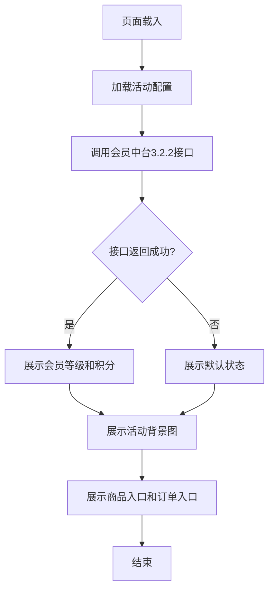
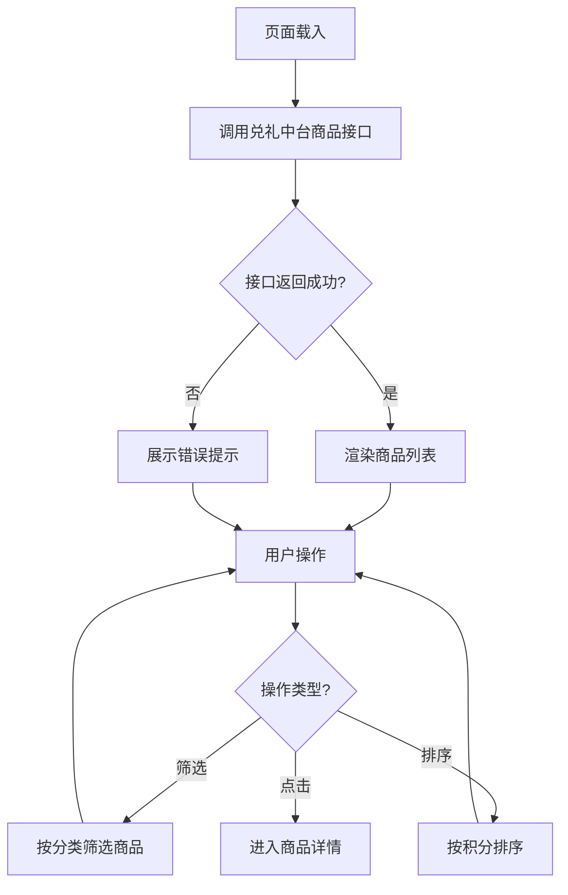
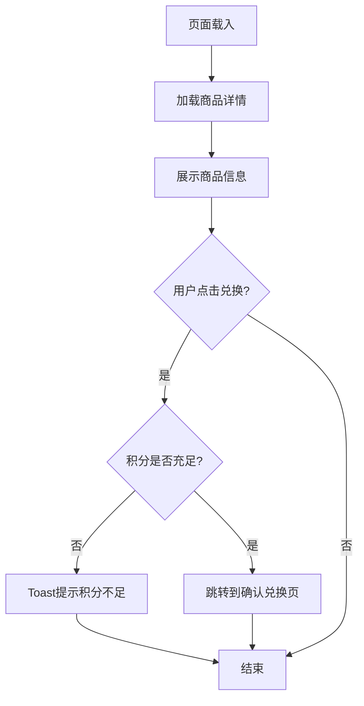
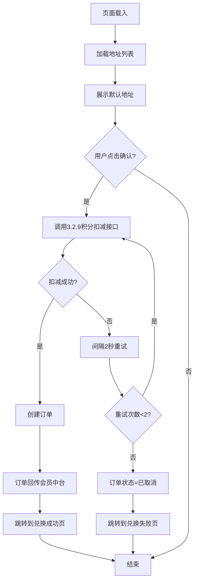
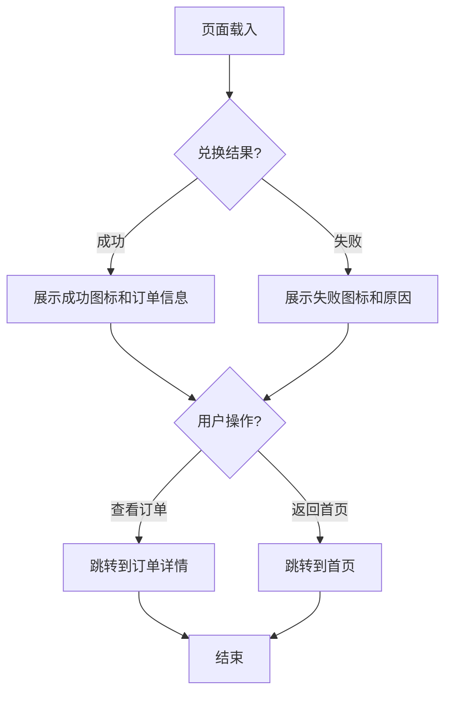
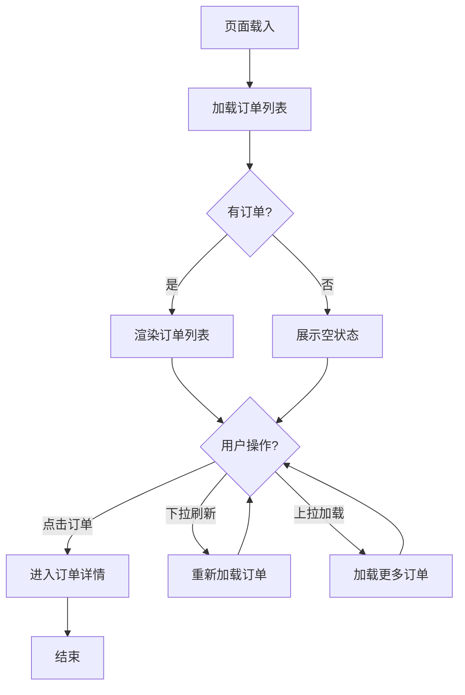
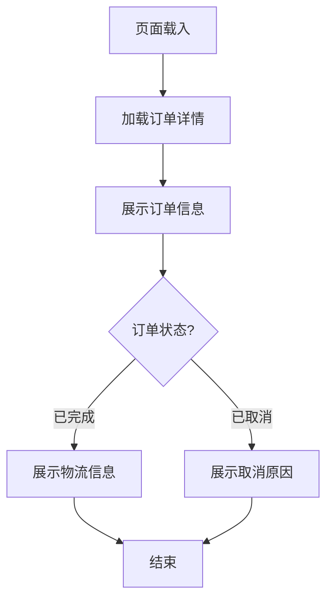
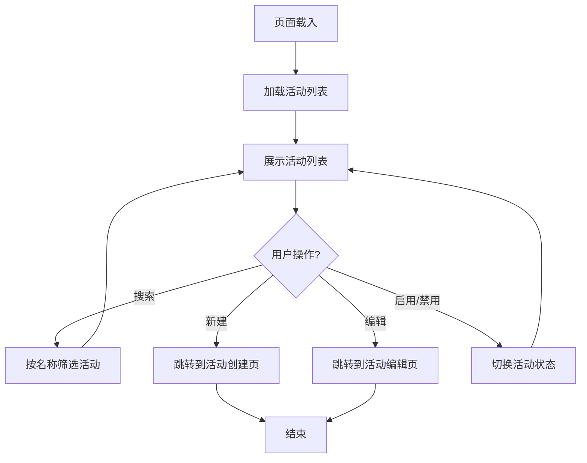
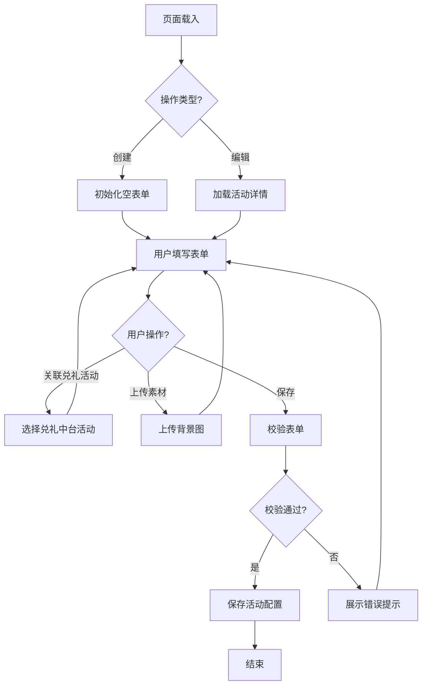

# 页面详细设计文档

## 1. 首页 (/home)

### 1.1 页面说明
小程序入口页面，展示活动主题、会员积分信息和兑礼商品入口。

### 1.2 功能描述
- 展示活动背景图（可配置）
- 展示会员积分余额和等级
- 展示兑礼商品入口
- 支持跳转到商品列表、我的订单

### 1.3 业务流程图

### 1.4 页面原型引用
待原型确认后补充

---

## 2. 商品列表页 (/productList)

### 2.1 页面说明
展示所有可兑换的商品列表，支持分类筛选和排序。

### 2.2 功能描述
- 商品卡片展示（图片、名称、所需积分）
- 支持分类筛选
- 支持积分排序（从低到高/高到低）
- 支持下拉刷新和上拉加载
- 支持点击进入商品详情

### 2.3 业务流程图

### 2.4 页面原型引用
待原型确认后补充

---

## 3. 商品详情页 (/productDetail)

### 3.1 页面说明
展示商品详细信息，包括图片、描述、所需积分和兑换按钮。

### 3.2 功能描述
- 商品图片轮播展示
- 商品名称、描述、所需积分展示
- 库存状态展示
- 兑换按钮（积分不足时禁用）
- 支持分享

### 3.3 业务流程图

### 3.4 页面原型引用
待原型确认后补充

---

## 4. 确认兑换页 (/confirmExchange)

### 4.1 页面说明
用户确认兑换信息并选择收货地址，完成积分扣减和订单创建。

### 4.2 功能描述
- 展示商品信息（缩略图、名称、所需积分）
- 选择收货地址（调用淘宝地址接口）
- 展示当前积分和兑换后剩余积分
- 确认兑换按钮
- 积分扣减和订单创建流程

### 4.3 业务流程图

### 4.4 页面原型引用
待原型确认后补充

---

## 5. 兑换结果页 (/exchangeResult)

### 5.1 页面说明
展示兑换成功或失败的结果，提供后续操作入口。

### 5.2 功能描述
- 成功/失败结果展示
- 订单信息展示（成功时）
- 查看订单按钮
- 返回首页按钮

### 5.3 业务流程图

### 5.4 页面原型引用
待原型确认后补充

---

## 6. 订单列表页 (/orderList)

### 6.1 页面说明
展示所有兑礼订单列表，支持查看订单详情。

### 6.2 功能描述
- 订单卡片展示（商品图片、名称、订单状态、时间）
- 支持下拉刷新和上拉加载
- 空状态展示
- 点击进入订单详情

### 6.3 业务流程图

### 6.4 页面原型引用
待原型确认后补充

---

## 7. 订单详情页 (/orderDetail)

### 7.1 页面说明
展示订单详细信息，包括商品信息、收货地址、物流信息。

### 7.2 功能描述
- 订单状态展示（已完成/已取消）
- 商品信息展示
- 收货地址展示
- 物流信息展示（已完成时）
- 取消原因展示（已取消时）

### 7.3 业务流程图

### 7.4 页面原型引用
待原型确认后补充

---

## 8. 活动列表页 (/activityList)

### 8.1 页面说明
管理端活动列表页面，支持查询、新建、编辑、启用/禁用活动。

### 8.2 功能描述
- 活动列表展示（名称、时间、状态、渠道、店铺）
- 活动名称搜索
- 新建活动按钮
- 编辑活动按钮
- 启用/禁用活动按钮

### 8.3 业务流程图

### 8.4 页面原型引用
待原型确认后补充

---

## 9. 活动编辑页 (/activityEdit)

### 9.1 页面说明
管理端活动创建和编辑页面，支持基础配置、活动配置、装修配置。

### 9.2 功能描述
- 基础配置：活动名称、活动说明、开始时间、结束时间
- 活动配置：关联兑礼中台活动、商品绑定
- 装修配置：背景图上传、热区配置
- 保存活动

### 9.3 业务流程图

### 9.4 页面原型引用
待原型确认后补充
