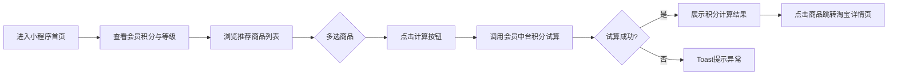

# PRD文档 - V1.0

## 1. 项目概述

### 1.1 需求背景与目标

**背景**：会员购买商品前无法直观知道能获得多少积分，缺乏积分激励透明度。

| 目标类型 | 描述 | 衡量指标 | 目标值 |
|----------|------|----------|--------|
| 用户体验 | 用户可直观计算购买商品预期积分 | 试算按钮点击率 | 商品浏览用户的 30%+ 触发计算 |
| 转化激励 | 积分试算结果驱动购买决策 | 点击"计算"后跳转淘宝比例 | 计算用户的 50%+ 跳转商品详情 |
| 运营效率 | 运营可灵活配置活动商品 | 活动创建到上线耗时 | < 10 分钟 |
| 数据监控 | 运营可监控活动效果和异常 | 看板数据延迟 | T+0 |

### 1.2 用户角色

| 角色 | 端口 | 描述 |
|------|------|------|
| C 端会员 | 天猫小程序端 | 查看积分等级、浏览商品、多选商品计算积分 |
| B 端运营 | 管理后台 | 管理活动、配置商品、查看数据看板 |

## 2. 需求分析

### 2.1 业务流程图

**C 端核心流程（横向）：**

**B 端核心流程（横向）：**

### 2.2 用户故事

| 故事编号 | 端口 | 用户故事 |
|----------|------|----------|
| S01 | 小程序端 | 作为会员，我能查看当前积分余额和会员等级 |
| S02 | 小程序端 | 作为会员，我能浏览后台配置的推荐商品列表 |
| S03 | 小程序端 | 作为会员，我能多选商品后点击"计算"按钮，查看预计可获得积分 |
| S04 | 小程序端 | 作为会员，我能点击商品跳转到淘宝商品详情页 |
| S05 | 管理端 | 作为运营，我能创建、编辑、启用、禁用兑礼活动 |
| S06 | 管理端 | 作为运营，我能为活动配置推荐商品 |
| S07 | 管理端 | 作为运营，我能查看活动曝光 PV/UV 和 C 端异常日志 |

### 2.3 业务对象

| 业务对象 | 对象属性 |
|----------|----------|
| 会员 | 会员ID、会员等级、当前积分余额 |
| 活动 | 活动ID、活动名称、开始时间、结束时间、状态（启用/禁用） |
| 活动商品 | 关联ID、活动ID、商品ID、排序权重 |
| 商品 | 商品ID、商品名称、商品价格、商品图片URL、商品详情链接、来源标识 |
| 积分试算结果 | 商品ID列表、预估积分总额 |
| 行为日志 | 日志ID、事件类型、用户ID、活动ID、异常信息、创建时间 |

### 2.4 页面列表

**C 端（天猫小程序）**

| 页面ID | 页面名称 | 页面功能 | 用户操作 |
|--------|----------|----------|----------|
| `/home` | 首页 | 聚合展示会员信息、推荐商品列表、积分计算、结果展示 | 浏览积分/等级、多选商品、点击计算、点击商品跳转淘宝 |

**B 端（管理后台）**

| 页面ID | 页面名称 | 页面功能 | 用户操作 |
|--------|----------|----------|----------|
| `/activityList` | 活动列表 | 展示所有兑礼活动，支持创建、启用/禁用、编辑 | 新建活动、切换启用/禁用、进入编辑 |
| `/activityEdit` | 活动配置 | 配置活动时间、选择推荐商品 | 设置时间、从商品池勾选商品、保存 |
| `/productConfig` | 商品配置 | 从淘宝批量拉取商品，管理推荐商品池 | 同步淘宝商品、上下架商品 |
| `/dashboard` | 信息看板 | 展示活动曝光 PV/UV、C 端异常日志 | 筛选活动、查看报表 |

### 2.5 用户故事

| 故事编号 | 端口 | 用户故事 |
|----------|------|----------|
| S01 | 小程序端 | 作为会员，我能查看当前积分余额和会员等级 |
| S02 | 小程序端 | 作为会员，我能浏览后台配置的推荐商品列表 |
| S03 | 小程序端 | 作为会员，我能多选商品后点击"计算"按钮，查看预计可获得积分 |
| S04 | 小程序端 | 作为会员，我能点击商品跳转到淘宝商品详情页 |
| S05 | 管理端 | 作为运营，我能创建、编辑、启用、禁用兑礼活动 |
| S06 | 管理端 | 作为运营，我能为活动配置推荐商品 |
| S07 | 管理端 | 作为运营，我能查看活动曝光 PV/UV 和 C 端异常日志 |

### 2.6 埋点方案

| 埋点事件ID | 页面 | 事件名称 | 埋点参数 |
|------------|------|----------|----------|
| `/home/pv` | `/home` | 首页曝光 | 活动ID、用户ID |
| `/home/feat-1` | `/home` | 点击计算按钮 | 活动ID、选中商品ID列表、商品数量 |
| `/home/feat-2` | `/home` | 商品点击跳转淘宝 | 商品ID、活动ID |
| `/home/feat-3` | `/home` | 商品勾选/取消勾选 | 商品ID、勾选状态 |
| `/home/feat-4` | `/home` | 积分试算成功 | 活动ID、商品ID列表、预估积分 |
| `/home/feat-4/err-1` | `/home` | 积分试算接口异常 | 活动ID、错误信息、错误码 |
| `/home/feat-4/err-2` | `/home` | 会员信息查询异常 | 错误信息、错误码 |

### 2.7 异常场景

| 异常编号 | 场景 | 系统来源 | 前端处理 | 后端处理 |
|----------|------|----------|----------|----------|
| `/home/feat-4/err-1` | 积分试算接口调用失败（超时/服务不可用） | 会员中台 DL 2.2.95 | Toast："系统繁忙，请稍后重试" | 记录异常日志，上报埋点 |
| `/home/feat-4/err-2` | 会员信息查询失败（非会员/未登录） | 会员中台 DL-3.2.7 / DL-3.2.4 | Toast："获取会员信息失败，请稍后重试" | 记录异常日志，上报埋点 |
| `/activityList/feat-1/err-1` | 淘宝商品已下架，C 端仍展示 | 淘宝 | 跳转后 404 由淘宝侧处理 | 管理端支持手动刷新/下架过期商品 |
| `/home/feat-4/err-3` | 活动已过期，C 端不可见活动 | 管理端 | 首页不展示已过期活动 | 活动到期自动禁用 |
